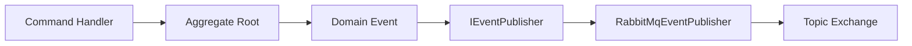
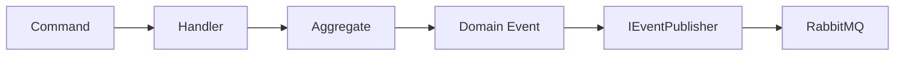
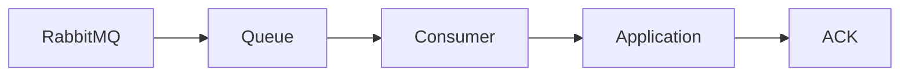

# ADR-007 — RabbitMQ

## Registro de Decisões

| ID | Decisão |
|----|----------|
| D01 | RabbitMQ será o Message Broker da solução. |
| D02 | Será utilizada uma única Topic Exchange denominada `orderflow.events`. |
| D03 | Routing Keys seguirão o padrão `<aggregate>.<evento>`. |
| D04 | Queues seguirão o padrão `<aggregate>.<evento>.queue`. |
| D05 | A publicação ocorrerá através da abstração `IEventPublisher`. |
| D06 | RabbitMQ permanecerá isolado na camada Infrastructure. |
| D07 | O processamento utilizará Manual ACK. |
| D08 | Publisher Confirm será habilitado. |
| D09 | As filas serão configuradas como Durable. |
| D10 | As mensagens serão publicadas como Persistent. |
| D11 | O modelo de entrega será At Least Once. |
| D12 | O Prefetch Count inicial será igual a 1. |
| D13 | Será utilizada uma Connection reutilizável por processo. |
| D14 | Channels não serão compartilhados concorrentemente entre threads. |

## Escopo desta ADR

Esta ADR define exclusivamente a arquitetura base de mensageria utilizando RabbitMQ no OrderFlow.

Estão contempladas neste documento:

- Escolha do Message Broker;
- Arquitetura de publicação e consumo;
- Organização das camadas;
- Convenções de Exchanges, Queues e Routing Keys;
- Estratégias de confiabilidade adotadas na infraestrutura.

Não fazem parte do escopo desta ADR:

- Outbox Pattern;
- Inbox Pattern;
- Idempotência;
- Retry;
- Dead Letter Queue;
- Versionamento de Eventos;
- Observabilidade.

Esses assuntos são tratados em ADRs específicas.

> **Categoria:** Messaging
>
> **Data:** 20/07/2026
>
> **Relacionada:**
>
> - ADR-003 — CQRS
> - ADR-004 — Domain Events
> - ADR-008 — Domain Events
> - ADR-009 — Outbox Pattern
> - ADR-010 — Inbox Pattern
> - ADR-011 — Idempotência
> - ADR-012 — Retry
> - ADR-013 — Dead Letter Queue

---

# Contexto

O OrderFlow foi concebido como um laboratório para estudo e implementação de arquiteturas distribuídas utilizando .NET, Clean Architecture, DDD, CQRS e mensageria.

Até este momento do projeto, a comunicação entre os componentes ocorre apenas dentro do mesmo processo através do MediatR e da publicação de Domain Events.

Embora essa abordagem seja suficiente para cenários monolíticos, ela não atende aos requisitos de uma arquitetura distribuída, onde diferentes serviços precisam reagir aos mesmos acontecimentos de negócio de forma assíncrona, independente e resiliente.

Para permitir essa evolução, torna-se necessária a adoção de um Message Broker capaz de desacoplar produtores e consumidores de eventos, garantindo escalabilidade, confiabilidade e facilidade de evolução da solução.

---

# Problema

A comunicação síncrona entre componentes apresenta algumas limitações importantes quando aplicada a sistemas distribuídos:

- Alto acoplamento entre serviços.
- Dependência da disponibilidade imediata do consumidor.
- Baixa resiliência diante de falhas temporárias.
- Escalabilidade limitada.
- Maior tempo de resposta das operações.
- Dificuldade para adicionar novos consumidores sem alterar o produtor.

Além disso, o projeto tem como objetivo estudar padrões avançados de Reliable Messaging, como:

- Publisher Confirm;
- Manual ACK;
- Retry;
- Dead Letter Queue;
- Outbox Pattern;
- Inbox Pattern;
- Idempotência.

Esses requisitos tornam necessária a utilização de uma plataforma de mensageria robusta.

---

# Drivers Arquiteturais

As decisões descritas nesta ADR foram guiadas pelos seguintes drivers arquiteturais.

## Baixo Acoplamento

O produtor não deve conhecer quem irá consumir os eventos publicados.

Novos consumidores deverão ser adicionados sem necessidade de alteração no código do produtor.

---

## Escalabilidade Horizontal

A arquitetura deve permitir que consumidores sejam escalados horizontalmente de forma independente do produtor.

---

## Confiabilidade

A perda de mensagens deve ser minimizada.

A solução deverá servir de base para implementação dos padrões de Reliable Messaging estudados ao longo do projeto.

---

## Evolução

A arquitetura deve facilitar a inclusão de novos eventos de domínio e novos consumidores sem alterações significativas na infraestrutura existente.

---

## Separação de Responsabilidades

As regras de negócio não devem conhecer detalhes da infraestrutura de mensageria.

A camada de Application deve depender apenas de abstrações.

A implementação concreta deverá permanecer isolada na Infrastructure.

---

## Testabilidade

A publicação de eventos deve ser facilmente substituível por implementações fake ou mocks durante testes unitários.

---

## Observabilidade

A arquitetura deverá facilitar futuras implementações de:

- Logs estruturados;
- Métricas;
- Distributed Tracing;
- Monitoramento de filas;
- Auditoria.

---

# Alternativas Consideradas

Durante o desenho da arquitetura foram consideradas as seguintes alternativas.

## Comunicação síncrona (HTTP)

### Vantagens

- Simplicidade.
- Fácil depuração.
- Menor infraestrutura.

### Desvantagens

- Alto acoplamento.
- Dependência entre serviços.
- Menor resiliência.
- Baixa escalabilidade.

**Decisão:** Rejeitada.

---

## RabbitMQ

### Vantagens

- Implementação do protocolo AMQP.
- Ampla adoção pelo mercado.
- Excelente integração com .NET.
- Suporte nativo a Exchanges, Queues e Routing.
- Recursos para Reliable Messaging.
- Facilidade para estudos dos padrões Outbox, Retry e DLQ.

### Desvantagens

- Necessidade de infraestrutura adicional.
- Maior complexidade operacional quando comparado à comunicação síncrona.

**Decisão:** Aceita.

---

## Apache Kafka

### Vantagens

- Altíssimo throughput.
- Excelente retenção de eventos.
- Reprocessamento por offset.
- Ideal para Event Streaming.

### Desvantagens

- Complexidade superior.
- Excesso de recursos para os objetivos atuais do OrderFlow.
- Curva de aprendizado maior.

**Decisão:** Não adotado neste momento.

Poderá ser objeto de um laboratório específico no futuro.

---

## Azure Service Bus

### Vantagens

- Serviço totalmente gerenciado.
- Alta disponibilidade.
- Integração com o ecossistema Azure.

### Desvantagens

- Dependência de nuvem específica.
- Custos operacionais.
- Menor portabilidade para ambiente local.

**Decisão:** Não adotado.

# Decisão

O OrderFlow adotará o **RabbitMQ** como Message Broker oficial para comunicação assíncrona entre componentes da solução.

A comunicação será baseada no protocolo **AMQP 0-9-1**, utilizando uma arquitetura orientada a eventos (Event-Driven Architecture), onde produtores publicam acontecimentos do domínio e consumidores os processam de forma independente.

A implementação seguirá os princípios da **Clean Architecture**, mantendo todo o acoplamento com RabbitMQ isolado na camada **Infrastructure**, enquanto as camadas **Domain** e **Application** dependerão exclusivamente de abstrações.

---

# Decisões Arquiteturais Consolidadas

| Item | Decisão |
|------|----------|
| Message Broker | RabbitMQ |
| Protocolo | AMQP 0-9-1 |
| Arquitetura | Event-Driven Architecture |
| Tipo de Exchange | Topic Exchange |
| Quantidade de Exchanges | Uma Exchange principal |
| Nome da Exchange | `orderflow.events` |
| Routing Key | `<aggregate>.<evento>` |
| Convenção de Queue | `<aggregate>.<evento>.queue` |
| ACK | Manual |
| Publisher Confirm | Habilitado |
| Delivery Guarantee | At Least Once |
| Queue | Durable |
| Mensagens | Persistent |
| Prefetch Count Inicial | 1 |
| Organização | RabbitMQ isolado na Infrastructure |
| Connection | Uma Connection reutilizada por processo |
| Channel | Criado a partir da Connection, sem compartilhamento concorrente entre threads |

---

# Organização da Solução

A arquitetura deverá manter as responsabilidades claramente separadas entre as camadas da aplicação.

## Domain

Responsável exclusivamente pelas regras de negócio.

Contém:

- Entidades;
- Value Objects;
- Domain Events;
- Interfaces de repositório.

O Domain não possui qualquer conhecimento sobre RabbitMQ ou qualquer outra tecnologia de mensageria.

---

## Application

A camada de Application conhece apenas abstrações.

Será definida uma interface responsável pela publicação de eventos.

Exemplo:

```text
Application

└── Abstractions

    └── Messaging

        └── IEventPublisher
```

Os Command Handlers dependerão exclusivamente dessa abstração.

---

## Infrastructure

Toda a implementação concreta da mensageria permanecerá nesta camada.

Exemplo de organização:

Exemplo de organização lógica:

```text
Infrastructure

└── Messaging

    └── RabbitMQ

        ├── Configuration
        ├── Publishers
        ├── Consumers
        ├── Dependency Injection
        └── Support Classes
```
Essa separação garante que futuras substituições do RabbitMQ por outro Message Broker não impactem as camadas superiores.

---

# Fluxo Arquitetural



Observe que o Command Handler conhece apenas a abstração `IEventPublisher`.

Toda a infraestrutura permanece encapsulada na camada Infrastructure.

---

# Convenções Adotadas

Para manter consistência em toda a solução, serão utilizadas as seguintes convenções.

## Exchange

A arquitetura adotará uma única **Topic Exchange**, responsável por receber todos os eventos publicados pela aplicação e encaminhá-los às filas correspondentes com base nas *Routing Keys* configuradas.

A utilização de uma Exchange centraliza o roteamento das mensagens, simplifica a administração da infraestrutura e facilita a inclusão de novos consumidores sem necessidade de alterações nos produtores.

Nome da Exchange:

```text
orderflow.events
```

Essa convenção estabelece um ponto único de entrada para os eventos de domínio publicados pela aplicação, servindo como base para a estratégia de roteamento definida nesta ADR.

---

## Routing Keys

As **Routing Keys** seguirão um padrão padronizado de nomenclatura, permitindo que a **Topic Exchange** realize o roteamento das mensagens de forma previsível e consistente.

Será adotada a seguinte convenção:

```text
<aggregate>.<evento>
```

Exemplos:

```text
order.created

order.paid

order.cancelled

payment.approved

payment.failed

inventory.reserved

inventory.released
```

Essa convenção oferece os seguintes benefícios:

- Padroniza a identificação dos eventos publicados.
- Facilita a utilização de curingas (`*` e `#`) nos bindings.
- Simplifica a criação de novos consumidores.
- Torna o roteamento das mensagens mais intuitivo e de fácil manutenção.
- Favorece a escalabilidade da arquitetura sem impactar os produtores de eventos.

---

## Queues

As filas serão responsáveis por armazenar as mensagens encaminhadas pela **Topic Exchange** até que sejam processadas por seus respectivos consumidores.

Será adotada a seguinte convenção de nomenclatura:

```text
<aggregate>.<evento>.queue
```

Exemplos:

```text
order.created.queue

order.cancelled.queue

payment.approved.queue
```

Quando necessário, filas auxiliares seguirão a mesma convenção de nomenclatura, preservando a padronização da arquitetura.

Exemplos:

**Retry Queue**

```text
order.created.retry.queue
```

**Dead Letter Queue (DLQ)**

```text
order.created.dlq
```

Essa convenção oferece os seguintes benefícios:

- Padroniza a identificação das filas.
- Facilita a associação entre Routing Keys, Queues e Consumers.
- Simplifica a manutenção e a operação da infraestrutura.
- Favorece a implementação de estratégias de Retry e Dead Letter Queue.
- Melhora a rastreabilidade dos eventos durante a operação e o monitoramento da solução.

---

## Consumers

Cada **Consumer** será responsável pelo processamento de um único tipo de evento, seguindo o princípio da responsabilidade única (*Single Responsibility Principle – SRP*).

Exemplos:

```text
OrderCreatedConsumer

OrderPaidConsumer

OrderCancelledConsumer
```

Essa abordagem proporciona os seguintes benefícios:

- Responsabilidades bem definidas para cada Consumer.
- Maior facilidade para testes unitários e de integração.
- Evolução independente do processamento de cada evento.
- Escalabilidade horizontal por tipo de evento.
- Redução do impacto de alterações em funcionalidades não relacionadas.
- Melhor rastreabilidade durante o monitoramento e a investigação de falhas.

Cada Consumer será responsável exclusivamente por receber a mensagem, orquestrar a execução da lógica de negócio correspondente e confirmar o processamento por meio do **Manual ACK**. Questões relacionadas a Retry, Dead Letter Queue e Idempotência serão tratadas pelas estratégias definidas em suas respectivas ADRs.

---

# Estratégia de Publicação

Os eventos serão publicados através da abstração `IEventPublisher`.

Fluxo:



Essa estratégia garante:

- Baixo acoplamento;
- Facilidade para testes unitários;
- Independência da tecnologia de mensageria;
- Facilidade para futuras substituições do Message Broker.

---

# Estratégia de Consumo

Cada fila possuirá um Consumer dedicado.

Fluxo:



O processamento seguirá o modelo de confirmação manual (Manual ACK), garantindo que uma mensagem seja removida da fila apenas após a conclusão bem-sucedida do processamento.

---

# Decisões Deliberadamente Postergadas

Os seguintes assuntos fazem parte da arquitetura de mensageria, porém serão detalhados em ADRs específicas:

- ADR-008 — Domain Events;
- ADR-009 — Outbox Pattern;
- ADR-010 — Inbox Pattern;
- ADR-011 — Idempotência;
- ADR-012 — Retry;
- ADR-013 — Dead Letter Queue.

Esta ADR estabelece apenas a arquitetura base sobre a qual essas decisões serão implementadas.

# Justificativa

A adoção do RabbitMQ foi motivada pela necessidade de desacoplar produtores e consumidores de eventos, permitindo que diferentes componentes da solução evoluam de forma independente.

A utilização de uma arquitetura orientada a eventos reduz dependências entre módulos, melhora a escalabilidade da solução e cria a base necessária para implementação dos padrões de Reliable Messaging previstos para o OrderFlow.

A escolha de uma única Topic Exchange simplifica significativamente a administração da infraestrutura, reduz a quantidade de configurações necessárias e aproveita o mecanismo de Routing Keys para distribuição inteligente das mensagens.

A separação entre abstrações (Application) e implementações concretas (Infrastructure) preserva os princípios da Clean Architecture, evitando que regras de negócio dependam de tecnologias específicas.

---

# Consequências Positivas

A adoção desta arquitetura proporciona os seguintes benefícios:

- Baixo acoplamento entre produtores e consumidores.
- Facilidade para inclusão de novos consumidores.
- Escalabilidade horizontal dos componentes responsáveis pelo processamento de eventos.
- Independência entre regras de negócio e infraestrutura de mensageria.
- Facilidade para testes unitários através da abstração `IEventPublisher`.
- Base sólida para implementação de Outbox Pattern.
- Base sólida para implementação de Inbox Pattern.
- Base para estratégias de Retry e Dead Letter Queue.
- Maior observabilidade do fluxo de mensagens.
- Arquitetura preparada para evolução futura.

---

# Consequências Negativas

Como toda decisão arquitetural, esta abordagem também introduz novos desafios.

- Aumento da complexidade da solução.
- Necessidade de administrar infraestrutura adicional.
- Maior dificuldade para depuração quando comparada à comunicação síncrona.
- Necessidade de monitoramento constante das filas.
- Necessidade de políticas de Retry e tratamento de falhas.

Esses custos são considerados aceitáveis diante dos benefícios obtidos.

---

# Trade-offs

As principais trocas realizadas nesta decisão arquitetural são apresentadas abaixo.

| Decisão | Benefício | Custo |
|----------|-----------|-------|
| RabbitMQ | Baixo acoplamento | Infraestrutura adicional |
| Topic Exchange | Flexibilidade | Maior necessidade de padronização das Routing Keys |
| Uma única Exchange | Simplicidade operacional | Maior concentração de eventos em um único ponto |
| Manual ACK | Maior confiabilidade | Código de consumo mais complexo |
| Publisher Confirm | Garantia de publicação | Pequeno aumento de latência |
| Durable Queue | Persistência da infraestrutura | Maior utilização de disco |
| Persistent Messages | Redução do risco de perda | Pequeno impacto na escrita |
| At Least Once | Minimiza perda de mensagens | Necessidade de Idempotência |
| Prefetch = 1 | Processamento previsível | Throughput inicial menor |

---

# Impacto nas Camadas

## Domain

Nenhum impacto estrutural.

O Domain permanece responsável apenas pelas regras de negócio e Domain Events.

Não conhece RabbitMQ.

---

## Application

Passa a depender da abstração:

```text
IEventPublisher
```

Não conhece implementações concretas.

Permanece desacoplada da infraestrutura.

---

## Infrastructure

Passa a ser responsável por:

- gerenciamento da Connection;
- gerenciamento dos Channels;
- publicação de mensagens;
- configuração de Exchanges;
- configuração de Queues;
- configuração dos Consumers;
- integração com RabbitMQ.

---

## WebApi

Nenhuma responsabilidade relacionada ao RabbitMQ.

A WebApi continua apenas iniciando os casos de uso da Application.

---

# Decisões Futuras

Esta ADR estabelece apenas a infraestrutura base da mensageria.

Os seguintes assuntos serão detalhados em documentos específicos:

- ADR-008 — Domain Events;
- ADR-009 — Outbox Pattern;
- ADR-010 — Inbox Pattern;
- ADR-011 — Idempotência;
- ADR-012 — Retry;
- ADR-013 — Dead Letter Queue;
- ADR-014 — Observabilidade;
- ADR-015 — Estratégia de Testes;
- ADR-016 — Versionamento de Eventos.

---

# Relação com outras ADRs

| ADR | Relação |
|------|----------|
| ADR-003 | A publicação de eventos ocorre após a execução dos Commands definidos na arquitetura CQRS. |
| ADR-004 | Os Domain Events definidos nesta ADR são publicados utilizando a arquitetura descrita neste documento. |
| ADR-008 | Define como os Domain Events serão modelados e publicados. |
| ADR-009 | Utiliza a infraestrutura descrita nesta ADR para resolver o Dual Write Problem. |
| ADR-010 | Complementa esta arquitetura garantindo processamento idempotente do lado do consumidor. |
| ADR-011 | Implementa a estratégia de Idempotência necessária pelo modelo At Least Once. |
| ADR-012 | Define as políticas de Retry para os Consumers desta arquitetura. |
| ADR-013 | Complementa esta ADR com a estratégia de tratamento de mensagens não processadas. |

---

# Referências

- RabbitMQ Documentation
- AMQP 0-9-1 Specification
- Enterprise Integration Patterns — Gregor Hohpe & Bobby Woolf
- Building Event-Driven Microservices — Adam Bellemare
- Clean Architecture — Robert C. Martin
- Domain-Driven Design — Eric Evans
- Microsoft Cloud Design Patterns

## Glossário

| Termo | Descrição |
|--------|-----------|
| Exchange | Responsável por receber mensagens dos produtores e roteá-las para filas. |
| Queue | Estrutura responsável por armazenar mensagens até seu consumo. |
| Binding | Associação entre Exchange e Queue. |
| Routing Key | Chave utilizada para roteamento das mensagens. |
| Publisher Confirm | Confirmação do RabbitMQ ao produtor sobre o recebimento da mensagem. |
| ACK | Confirmação enviada pelo consumidor após processamento bem-sucedido. |
| Prefetch | Quantidade máxima de mensagens não confirmadas por consumidor. |

## Histórico

| Data | Alteração |
|------|-----------|
| 20/07/2026 | Criação da ADR-007 e definição da arquitetura base de mensageria com RabbitMQ. |

---

Essas limitações tornam inadequada a comunicação exclusivamente síncrona para os objetivos de escalabilidade, desacoplamento e confiabilidade estabelecidos para o OrderFlow.