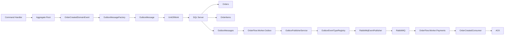

# ADR-009 - Outbox Pattern

**Status:** Aceita

> **Implementação concluída e validada.**

## Registro de Decisões

| ID | Decisão |
|---|---|
| D01 | O OrderFlow utilizará o Transactional Outbox Pattern para garantir a publicação confiável de eventos de domínio. |
| D02 | Os Domain Events serão persistidos na mesma transação da entidade de negócio. |
| D03 | A publicação no RabbitMQ ocorrerá de forma assíncrona por um Worker dedicado. |
| D04 | Eventos publicados com sucesso serão marcados como processados, preservando o histórico. |
| D05 | O Outbox será implementado utilizando SQL Server. |
| D06 | A publicação utilizará o RabbitMQ já existente na solução. |
| D07 | O Outbox será integrado ao Unit of Work da aplicação. |
| D08 | O Worker.Outbox será responsável exclusivamente pela publicação dos eventos pendentes. |
| D09 | A estratégia deverá ser compatível com Retry, Dead Letter Queue e futura implementação do Inbox Pattern. |
| D10 | Os tipos de Domain Events serão resolvidos por meio de um OutboxEventTypeRegistry, eliminando switch para desserialização. |
| D11 | Os Domain Events serão registrados somente após a montagem completa do Aggregate Root, garantindo que representem o estado final da entidade. |


## Escopo desta ADR

Esta ADR define a estratégia utilizada para garantir a publicação confiável de eventos gerados pelos agregados do domínio.

Estão contemplados:

Estão contemplados:

- persistência transacional dos eventos;
- armazenamento em Outbox;
- publicação assíncrona;
- responsabilidades do Worker.Outbox;
- integração com RabbitMQ;
- desserialização dos Domain Events;
- recuperação automática após indisponibilidade da infraestrutura.

Não fazem parte desta ADR:

- Retry;
- Dead Letter Queue;
- Inbox Pattern;
- Idempotência do consumidor;
- Observabilidade;
- Monitoramento.

> **Categoria:** Messaging / Reliability
>
> **Relacionadas:**
>
> - ADR-007 — RabbitMQ
> - ADR-012 — Retry
> - ADR-013 — Dead Letter Queue

---

# Contexto

Atualmente, quando um pedido é criado, o fluxo ocorre da seguinte forma:

```text
Order
    ↓
SaveChanges()
    ↓
Commit
    ↓
RabbitMQ
```

Caso o banco de dados confirme a transação e o RabbitMQ fique indisponível imediatamente após o commit, o pedido será persistido, porém o evento será perdido.

Essa situação é conhecida como **Dual Write Problem**, pois duas operações independentes precisam ocorrer com sucesso:

- persistência no banco;
- publicação da mensagem.

Sem coordenação entre elas, existe risco de inconsistência.

---

# Problema

A publicação direta para o RabbitMQ após o commit não oferece garantia de entrega.

Exemplos:

- indisponibilidade temporária do RabbitMQ;
- falha de rede;
- reinício da aplicação;
- encerramento inesperado do processo.

Nessas situações o banco permanece consistente, mas os consumidores jamais receberão o evento.

---

# Drivers Arquiteturais

## Confiabilidade

Nenhum evento de domínio deve ser perdido.

---

## Consistência

A gravação da entidade e do evento devem ocorrer na mesma transação.

---

## Recuperação

Caso o RabbitMQ esteja indisponível, o evento deverá permanecer armazenado até nova tentativa.

---

## Baixo Acoplamento

A camada Domain não conhecerá detalhes de publicação.

A Application continuará dependente apenas de abstrações.

---

# Alternativas Consideradas

## Publicação imediata após SaveChanges

**Vantagens**

- implementação simples.

**Desvantagens**

- risco de perda de mensagens;
- Dual Write Problem.

**Decisão:** Rejeitada.

---

## Transações distribuídas (2PC)

**Vantagens**

- consistência forte.

**Desvantagens**

- alta complexidade;
- baixo desempenho;
- dependência de infraestrutura específica.

**Decisão:** Rejeitada.

---

## Transactional Outbox

Funcionamento:

```text
Transaction

Orders
OutboxMessages

Commit

↓

Worker.Outbox

↓

RabbitMQ
```

**Vantagens**

- elimina perda de eventos;
- desacopla persistência da publicação;
- compatível com Event-Driven Architecture;
- amplamente utilizado em sistemas distribuídos.

**Desvantagens**

- aumenta a complexidade;
- exige Worker adicional;
- requer limpeza periódica da tabela.

**Decisão:** Aceita.

---

# Decisão

O OrderFlow utilizará o **Transactional Outbox Pattern**.

Todo Domain Event será persistido na tabela **OutboxMessages** durante a mesma transação utilizada para persistir o agregado.

Após o commit, um Worker dedicado consultará os eventos pendentes e realizará sua publicação no RabbitMQ.

A publicação dos eventos passou a ser realizada exclusivamente pelo `OrderFlow.Worker.Outbox`, eliminando a publicação direta da API para o RabbitMQ.

Os Domain Events são convertidos em registros da tabela `OutboxMessages` por meio do `OutboxMessageFactory`, preservando seu conteúdo até a publicação.

A resolução do tipo concreto do evento é realizada pelo `OutboxEventTypeRegistry`, permitindo a desserialização sem dependência de estruturas condicionais.

---

# Fluxo Arquitetural



---

# Responsabilidades

## Domain

- Implementar as regras de negócio e invariantes do Aggregate Root.
- Gerar Domain Events representando fatos ocorridos no domínio.
- Permanecer completamente independente de infraestrutura.

---

## Application

- Orquestrar os casos de uso.
- Persistir o Aggregate Root por meio do UnitOfWork.
- Permanecer desacoplada dos detalhes de mensageria.

---

## UnitOfWork

Responsável por:

- persistir o Aggregate Root;
- converter Domain Events em registros da Outbox por meio do `OutboxMessageFactory`;
- garantir que Aggregate Root e `OutboxMessages` sejam persistidos na mesma transação.

---

## Worker.Outbox

Responsável por:

- localizar mensagens não processadas na tabela `OutboxMessages`;
- resolver o tipo concreto do Domain Event por meio do `OutboxEventTypeRegistry`;
- desserializar o evento;
- publicar o evento no RabbitMQ;
- atualizar `ProcessedOnUtc` após publicação bem-sucedida;
- registrar falhas de publicação para nova tentativa.

---

## RabbitMQ

Responsável por distribuir os eventos para os consumidores, desacoplando a publicação da execução dos processos consumidores.

---

# Consequências Positivas

- elimina o Dual Write Problem;
- garante persistência transacional entre Aggregate Root e Outbox;
- publicação resiliente e assíncrona dos eventos;
- recuperação automática após indisponibilidade do RabbitMQ;
- recuperação automática após indisponibilidade do Worker.Outbox;
- desacoplamento entre persistência e mensageria;
- preservação do histórico de publicação por meio da tabela `OutboxMessages`;
- compatibilidade com o modelo **At Least Once Delivery**.

---

# Consequências Negativas

- necessidade de um Worker dedicado para publicação;
- criação e manutenção da tabela `OutboxMessages`;
- aumento da complexidade da infraestrutura;
- necessidade futura de política de limpeza da Outbox;
- consistência eventual entre banco de dados e consumidores.

---

# Trade-offs

| Decisão | Benefício | Custo |
|---|---|---|
| Transactional Outbox | Elimina perda de eventos | Maior complexidade |
| Worker.Outbox | Desacoplamento da publicação | Processo adicional |
| Persistência da Outbox | Recuperação automática | Maior utilização do banco |
| Publicação assíncrona | Resiliência | Consistência eventual |
| OutboxEventTypeRegistry | Extensibilidade e eliminação de `switch` | Registro explícito de novos eventos |

---

# Impacto nas Camadas

## Domain

Nenhum.

---

## Application

Integração com UnitOfWork.

---

## Infrastructure

Implementação da persistência, Transactional Outbox, Worker.Outbox, RabbitMQ e mecanismos de publicação assíncrona.

---

## Worker.Outbox

Novo componente responsável pela publicação dos eventos.

---

# Critérios de Validação

A implementação foi considerada concluída após a validação dos seguintes cenários:

- Aggregate Root e `OutboxMessages` persistidos na mesma transação;
- publicação assíncrona realizada exclusivamente pelo `OrderFlow.Worker.Outbox`;
- mensagens permanecem pendentes quando o RabbitMQ está indisponível;
- publicação automática após o retorno do RabbitMQ;
- mensagens permanecem pendentes quando o Worker.Outbox está indisponível;
- publicação automática após a inicialização do Worker.Outbox;
- preservação de `EventId`, `OccurredAt` e Payload durante serialização e desserialização;
- atualização de `ProcessedOnUtc` após publicação bem-sucedida;
- processamento completo até o ACK do Consumer.

---

# Referências

- Enterprise Integration Patterns
- Microservices Patterns — Chris Richardson
- Transactional Outbox Pattern
- Microsoft Architecture Guides

---

# Histórico

| Data | Alteração |
|---|---|
| 04/08/2026 | Criação da ADR-009 definindo a estratégia de Transactional Outbox do OrderFlow. |
| 06/08/2026 | Implementação concluída, documentação atualizada e cenários de resiliência validados. |