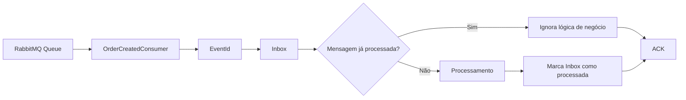

# ADR-010 - Inbox Pattern

**Status:** Aceita

## Registro de Decisões

| ID  | Decisão                                                                                                                          |
| --- | -------------------------------------------------------------------------------------------------------------------------------- |
| D01 | O OrderFlow utilizará o Inbox Pattern para garantir processamento idempotente das mensagens recebidas.                           |
| D02 | Cada evento recebido será identificado pelo `EventId` original gerado pelo produtor.                                             |
| D03 | O `EventId` será utilizado para detectar mensagens já processadas.                                                               |
| D04 | O registro da Inbox será persistido no SQL Server.                                                                               |
| D05 | O processamento da mensagem e a atualização de seu estado na Inbox deverão ocorrer de forma consistente.                         |
| D06 | Mensagens já processadas não executarão novamente a lógica de negócio.                                                           |
| D07 | Mensagens duplicadas deverão ser reconhecidas e confirmadas com ACK, evitando redelivery desnecessário.                          |
| D08 | A implementação será integrada inicialmente ao `OrderFlow.Worker.Payments`.                                                      |
| D09 | A infraestrutura da Inbox permanecerá na camada `Infrastructure`, preservando o Domain independente de mecanismos de mensageria. |
| D10 | A estratégia deverá ser compatível com Retry, Dead Letter Queue e o modelo At Least Once Delivery já adotado pelo OrderFlow.     |

## Escopo desta ADR

Esta ADR define a estratégia utilizada para garantir o processamento idempotente de eventos recebidos pelos consumidores do OrderFlow.

Estão contemplados:

* identificação das mensagens por `EventId`;
* persistência das mensagens recebidas;
* detecção de mensagens duplicadas;
* controle do estado de processamento;
* integração com os Consumers;
* confirmação de mensagens duplicadas por ACK;
* integração com o modelo At Least Once Delivery.

Não fazem parte desta ADR:

* regras específicas de pagamento;
* implementação de Saga;
* observabilidade distribuída;
* retenção e limpeza histórica da Inbox;
* versionamento de eventos.

> **Categoria:** Messaging / Reliability
>
> **Relacionadas:**
>
> * ADR-007 — RabbitMQ
> * ADR-009 — Outbox Pattern
> * ADR-012 — Retry
> * ADR-013 — Dead Letter Queue

---

# Contexto

O OrderFlow utiliza RabbitMQ com o modelo de entrega **At Least Once**, no qual uma mensagem pode ser entregue mais de uma vez ao consumidor.

Mesmo com o **Transactional Outbox Pattern** garantindo que os eventos sejam publicados de forma confiável, o consumidor ainda precisa lidar com possíveis redeliveries.

Considere o seguinte cenário:

```text
RabbitMQ
    ↓
Worker.Payments
    ↓
Processa mensagem
    ↓
Executa regra de negócio
    ↓
Falha antes do ACK
    ↓
RabbitMQ realiza redelivery
    ↓
Mensagem é processada novamente
```

Nesse cenário, embora o primeiro processamento tenha sido concluído, o RabbitMQ não recebeu a confirmação por meio do ACK e poderá entregar novamente a mesma mensagem.

O consumidor precisa, portanto, ser capaz de identificar que determinado evento já foi processado.

---

# Problema

O modelo **At Least Once Delivery** garante que uma mensagem não seja silenciosamente perdida, mas permite entregas duplicadas.

Sem um mecanismo de deduplicação, o mesmo evento poderá executar a lógica de negócio mais de uma vez.

Em operações sensíveis, isso pode provocar efeitos indesejados, como:

* processamento duplicado de pagamentos;
* atualização repetida do estado de uma entidade;
* execução duplicada de integrações externas;
* geração duplicada de novos eventos;
* inconsistência entre serviços.

O consumidor não pode depender exclusivamente do RabbitMQ para garantir processamento único.

É necessário persistir uma identificação das mensagens já processadas e verificar essa informação antes da execução da lógica de negócio.

---

# Drivers Arquiteturais

## Idempotência

O processamento repetido da mesma mensagem não deverá produzir efeitos de negócio duplicados.

---

## Confiabilidade

O consumidor deverá reconhecer mensagens já processadas mesmo após reinicializações do Worker ou novas entregas realizadas pelo RabbitMQ.

---

## Recuperação

O mecanismo deverá funcionar corretamente em cenários de falha e redelivery, permitindo que mensagens não concluídas sejam processadas novamente sem considerar como concluído um processamento que falhou.

---

## Consistência

O estado persistido na Inbox deverá representar corretamente o resultado do processamento da mensagem, evitando que uma mensagem seja marcada como processada antes da conclusão da operação correspondente.

---

## Baixo Acoplamento

A camada **Domain** permanecerá independente do mecanismo de Inbox e dos detalhes de mensageria.

A infraestrutura de deduplicação será mantida fora do domínio e integrada ao fluxo de consumo por meio de abstrações apropriadas.

---

# Alternativas Consideradas

## Confiar apenas no ACK e Redelivery do RabbitMQ

**Vantagens**

* implementação simples;
* nenhuma persistência adicional.

**Desvantagens**

* não impede o processamento duplicado;
* uma falha após a execução da regra de negócio e antes do ACK pode provocar novo processamento;
* não mantém histórico persistente das mensagens processadas.

**Decisão:** Rejeitada.

---

## Deduplicação em memória

Manter os `EventId` processados em memória no próprio Worker.

**Vantagens**

* implementação simples;
* consulta rápida;
* não exige acesso adicional ao banco de dados.

**Desvantagens**

* o histórico é perdido quando o processo é reiniciado;
* não funciona de forma confiável com múltiplas instâncias do Consumer;
* não oferece garantia durável de idempotência.

**Decisão:** Rejeitada.

---

## Inbox Pattern persistido no SQL Server

Funcionamento:

```text
RabbitMQ
    ↓
Consumer
    ↓
EventId
    ↓
Inbox
    ↓
Já processado?
    ├── Sim → ACK
    └── Não → Processamento
                    ↓
              Marca processado
                    ↓
                   ACK
```

**Vantagens**

* deduplicação persistente;
* mantém o controle após reinicializações do Worker;
* compatível com múltiplas instâncias de Consumers;
* complementa o modelo At Least Once Delivery;
* integra-se ao SQL Server já utilizado pela solução.

**Desvantagens**

* adiciona persistência ao fluxo de consumo;
* aumenta a complexidade do processamento;
* exige estratégia futura de retenção e limpeza dos registros.

**Decisão:** Aceita.

---

# Decisão

O OrderFlow utilizará o **Inbox Pattern** para controlar o processamento idempotente das mensagens recebidas.

Cada evento será identificado pelo `EventId` original gerado pelo produtor. Esse identificador será persistido no SQL Server e utilizado para detectar mensagens já processadas.

Antes de executar novamente a lógica de negócio, o fluxo de consumo verificará o estado correspondente na Inbox. Mensagens já concluídas não executarão novamente seus efeitos de negócio e poderão ser confirmadas com ACK.

Mensagens cujo processamento não tenha sido concluído deverão permanecer elegíveis para nova tentativa, preservando a compatibilidade com Retry, Dead Letter Queue e com o modelo **At Least Once Delivery** adotado pelo OrderFlow.

A implementação será integrada inicialmente ao `OrderFlow.Worker.Payments`, enquanto os detalhes de persistência permanecerão na camada `Infrastructure`, mantendo o Domain independente do mecanismo de mensageria.

---

# Fluxo Arquitetural



O fluxo garante que uma mensagem já concluída possa ser reconhecida antes da repetição dos seus efeitos de negócio.

Mensagens cujo processamento anterior não tenha sido concluído permanecem elegíveis para nova tentativa.

---

# Responsabilidades

## Consumer

Responsável por:

* receber e desserializar a mensagem proveniente do RabbitMQ;
* disponibilizar o `EventId` utilizado pelo mecanismo de Inbox;
* executar a lógica de processamento somente quando a mensagem ainda não tiver sido concluída;
* confirmar com ACK mensagens processadas com sucesso ou já reconhecidas como concluídas.

---

## Inbox

Responsável por:

* persistir a identificação das mensagens recebidas;
* utilizar o `EventId` para detectar mensagens duplicadas;
* controlar o estado de processamento;
* impedir a repetição dos efeitos de negócio de mensagens já concluídas.

---

## Infrastructure

Responsável por:

* implementar a persistência da Inbox no SQL Server;
* fornecer os componentes necessários para consulta e atualização dos registros da Inbox;
* integrar o mecanismo de Inbox ao fluxo de consumo sem introduzir dependências de infraestrutura no Domain.

---

## RabbitMQ

Responsável por:

* entregar as mensagens aos Consumers;
* realizar redelivery quando uma mensagem não for confirmada;
* manter o modelo **At Least Once Delivery** adotado pela solução.

O RabbitMQ não é responsável pela deduplicação dos efeitos de negócio. Essa responsabilidade pertence ao mecanismo de Inbox no lado consumidor.

---

# Consequências Positivas

* processamento idempotente das mensagens recebidas;
* proteção contra efeitos de negócio duplicados em cenários de redelivery;
* deduplicação persistente mesmo após reinicializações do Worker;
* compatibilidade com múltiplas instâncias de Consumers;
* complementa o modelo **At Least Once Delivery**;
* mantém o Domain independente dos mecanismos de mensageria e deduplicação.

---

# Consequências Negativas

* necessidade de persistência adicional no fluxo de consumo;
* aumento da complexidade do processamento das mensagens;
* consultas adicionais ao banco de dados;
* necessidade futura de estratégia de retenção e limpeza da Inbox.

---

# Trade-offs

| Decisão                                  | Benefício                              | Custo                                          |
| ---------------------------------------- | -------------------------------------- | ---------------------------------------------- |
| Inbox persistida                         | Deduplicação durável                   | Mais operações no banco                        |
| `EventId` como identificador da mensagem | Detecção consistente de duplicidades   | Dependência de identificador estável no evento |
| Verificação antes do processamento       | Evita repetição dos efeitos de negócio | Consulta adicional                             |
| ACK para mensagens já processadas        | Interrompe redelivery desnecessário    | Exige controle correto do estado da Inbox      |
| SQL Server                               | Reutiliza infraestrutura existente     | Crescimento da tabela da Inbox                 |

---

# Impacto nas Camadas

## Domain

Nenhum impacto direto. O Domain permanece independente do Inbox Pattern e dos detalhes de mensageria.

---

## Application

As abstrações necessárias ao processamento idempotente poderão ser expostas para permitir a integração sem dependência direta da infraestrutura.

---

## Infrastructure

Implementação da persistência da Inbox no SQL Server, incluindo modelo, configuração do Entity Framework Core e mecanismos de consulta e atualização.

---

## Worker.Payments

Integração do fluxo de consumo com a Inbox para detectar mensagens já processadas antes da execução da lógica de negócio.

---

# Critérios de Validação

A implementação será considerada concluída quando:

* uma mensagem recebida pela primeira vez for processada normalmente;
* o `EventId` da mensagem for persistido na Inbox;
* uma mensagem processada com sucesso for marcada como concluída;
* o redelivery do mesmo `EventId` não executar novamente a lógica de negócio;
* uma mensagem duplicada já concluída resultar em ACK;
* uma mensagem cujo processamento falhou permanecer elegível para nova tentativa;
* o controle de duplicidade continuar funcionando após reinicialização do Worker;
* o comportamento permanecer compatível com Retry e Dead Letter Queue.

---

# Referências

* Enterprise Integration Patterns
* Microservices Patterns — Chris Richardson
* Idempotent Consumer Pattern
* Microsoft Architecture Guides

---

# Histórico

| Data       | Alteração                                                                |
| ---------- | ------------------------------------------------------------------------ |
| 14/08/2026 | Criação da ADR-010 definindo a estratégia de Inbox Pattern do OrderFlow. |
