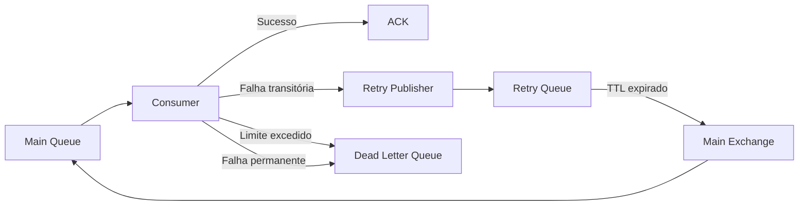

# ADR-012 - Retry

**Status:** Aceita

## Registro de Decisões

| ID | Decisão |
|---|---|
| D01 | O consumo não utilizará `requeue: true` como estratégia permanente de recuperação. |
| D02 | Falhas transitórias serão tratadas por meio de uma fila intermediária de Retry. |
| D03 | A fila de Retry utilizará TTL para controlar o intervalo entre as tentativas. |
| D04 | Após o vencimento do TTL, a mensagem retornará automaticamente à fila principal. |
| D05 | O número de tentativas será limitado. |
| D06 | A quantidade de tentativas será registrada nos headers da mensagem. |
| D07 | Ao exceder o limite configurado, a mensagem será encaminhada para uma Dead Letter Queue. |
| D08 | Falhas permanentes não passarão pelo fluxo de Retry. |
| D09 | A primeira implementação utilizará intervalo fixo entre tentativas. |
| D10 | A confirmação da mensagem continuará utilizando Manual ACK. |
| D11 | O fluxo seguirá o modelo de entrega At Least Once. |
| D12 | Os Consumers deverão ser idempotentes, pois uma mensagem poderá ser entregue mais de uma vez. |

## Escopo desta ADR

Esta ADR define a estratégia de reprocessamento de mensagens com falhas durante o consumo no **OrderFlow**.

Estão contemplados neste documento:

- classificação de falhas;
- fila intermediária de Retry;
- intervalo entre tentativas;
- limite máximo de reprocessamentos;
- controle do número de tentativas;
- retorno da mensagem à fila principal;
- encaminhamento para a futura Dead Letter Queue;
- impacto sobre ACK e NACK.

Não fazem parte do escopo desta ADR:

- estrutura detalhada da Dead Letter Queue;
- reprocessamento manual da DLQ;
- Inbox Pattern;
- Idempotência;
- Outbox Pattern;
- observabilidade;
- alertas operacionais;
- Retry de chamadas HTTP;
- Retry de operações com banco de dados.

Esses assuntos serão tratados em ADRs específicas.

> **Categoria:** Messaging / Reliability
>
> **Relacionadas:**
>
> - ADR-007 — RabbitMQ
> - ADR-010 — Inbox Pattern
> - ADR-011 — Idempotência
> - ADR-013 — Dead Letter Queue

---

# Contexto

O **OrderFlow** utiliza RabbitMQ para comunicação assíncrona entre processos.

Atualmente, o fluxo de consumo possui confirmação manual:

```text
RabbitMQ Queue
    ↓
Consumer
    ↓
Processamento
    ↓
ACK ou NACK
```

Quando o processamento é concluído com sucesso, o Consumer envia um `ACK`, permitindo que o RabbitMQ remova definitivamente a mensagem da fila.

Em caso de erro inesperado, a implementação inicial utiliza:

```csharp
await channel.BasicNackAsync(
    deliveryTag: eventArgs.DeliveryTag,
    multiple: false,
    requeue: true);
```

Essa abordagem devolve imediatamente a mensagem à mesma fila.

Embora funcione como mecanismo inicial de recuperação, ela não oferece controle sobre:

- quantidade de tentativas;
- intervalo entre tentativas;
- classificação do erro;
- isolamento de mensagens problemáticas;
- prevenção de ciclos infinitos;
- visibilidade operacional do reprocessamento.

Dessa forma, torna-se necessário definir uma estratégia explícita e controlada de Retry.

---

# Problema

A utilização contínua de:

```text
NACK + requeue = true
```

pode gerar um ciclo infinito de reentrega.

```text
Consumer
    ↓
Erro
    ↓
NACK com requeue
    ↓
Fila principal
    ↓
Consumer
    ↓
Erro novamente
```

Esse comportamento apresenta diversos riscos:

- consumo excessivo de CPU;
- alto volume de tráfego no RabbitMQ;
- processamento repetido sem intervalo;
- bloqueio de mensagens posteriores;
- crescimento de logs;
- dificuldade para investigar a falha;
- ausência de limite de tentativas;
- indisponibilidade parcial do Consumer;
- processamento indefinido de Poison Messages.

Além disso, nem todas as falhas devem ser tratadas da mesma forma.

Uma falha temporária pode ser resolvida em uma nova tentativa, enquanto uma falha permanente continuará acontecendo independentemente da quantidade de reprocessamentos.

---

# Drivers Arquiteturais

## Confiabilidade

Falhas temporárias não devem provocar perda imediata da mensagem.

A arquitetura deve permitir novas tentativas de processamento de forma controlada.

---

## Previsibilidade

O número de tentativas e o intervalo entre elas devem ser conhecidos e configuráveis.

---

## Proteção contra loops infinitos

Uma mensagem não pode permanecer sendo reprocessada indefinidamente.

---

## Resiliência

O Consumer deve conseguir se recuperar de indisponibilidades temporárias de serviços externos ou recursos locais.

---

## Isolamento de mensagens problemáticas

Mensagens que ultrapassem o limite de tentativas devem ser removidas do fluxo principal e encaminhadas para uma fila específica.

---

## Observabilidade

A estratégia deve permitir identificar:

- quantas tentativas foram realizadas;
- quando ocorreu a última falha;
- por que a mensagem foi reprocessada;
- quando a mensagem foi encaminhada à DLQ.

---

## Baixo acoplamento

A infraestrutura de Retry não deve ficar espalhada pelos Consumers concretos.

O comportamento comum deverá permanecer centralizado na infraestrutura de consumo.

---

# Classificação das Falhas

A estratégia distinguirá falhas transitórias de falhas permanentes.

## Falhas transitórias

São falhas que podem desaparecer após algum tempo.

Exemplos:

- indisponibilidade temporária de banco de dados;
- timeout em serviço externo;
- falha de rede;
- limitação temporária de recursos;
- dependência externa momentaneamente indisponível;
- lock ou concorrência transitória.

Essas falhas poderão seguir para Retry.

---

## Falhas permanentes

São falhas que não serão corrigidas apenas repetindo o processamento da mesma mensagem.

Exemplos:

- JSON inválido;
- propriedades obrigatórias ausentes;
- tipo de mensagem incompatível;
- dados semanticamente inválidos;
- versão de contrato não suportada;
- violação permanente de regra de negócio.

Essas mensagens não deverão retornar à fila principal.

Elas serão rejeitadas sem requeue e, quando a DLQ estiver configurada, encaminhadas diretamente para ela.

---

# Alternativas Consideradas

## Requeue imediato

### Funcionamento

```text
Consumer
    ↓
Erro
    ↓
NACK requeue true
    ↓
Fila principal
```

### Vantagens

- implementação simples;
- não exige filas adicionais;
- mensagem não é descartada imediatamente.

### Desvantagens

- ciclo infinito;
- reprocessamento sem intervalo;
- consumo excessivo de recursos;
- ausência de limite;
- baixa observabilidade;
- risco de bloquear o fluxo.

**Decisão:** Rejeitada como estratégia permanente.

---

## Retry dentro do processo com `Task.Delay`

### Funcionamento

```text
Consumer
    ↓
Erro
    ↓
Task.Delay
    ↓
Nova tentativa no mesmo processo
```

### Vantagens

- implementação simples;
- não exige topologia adicional;
- fácil compreensão inicial.

### Desvantagens

- mantém a mensagem em estado `Unacked`;
- ocupa o Channel durante a espera;
- reduz a capacidade de processamento;
- perde o estado em caso de reinício do Worker;
- não distribui o reprocessamento pelo broker;
- dificulta escalabilidade horizontal.

**Decisão:** Rejeitada.

---

## Biblioteca de resiliência dentro do Consumer

Poderia ser utilizado um mecanismo como Polly para repetir o processamento dentro do próprio processo.

### Vantagens

- políticas configuráveis;
- suporte a intervalos progressivos;
- fácil integração com código .NET.

### Desvantagens

- mantém a entrega pendente durante as tentativas;
- ocupa recursos do Consumer;
- reinício do processo interrompe o fluxo;
- não torna o Retry visível no RabbitMQ;
- não resolve sozinho a necessidade de DLQ.

**Decisão:** Não adotada para Retry de mensagens.

Políticas locais ainda poderão ser utilizadas futuramente para chamadas específicas realizadas durante o processamento.

---

## Retry Queue com TTL

### Funcionamento

```text
Fila principal
    ↓
Consumer
    ↓
Erro transitório
    ↓
Retry Queue
    ↓
TTL
    ↓
Fila principal
```

### Vantagens

- intervalo controlado;
- mensagem permanece gerenciada pelo RabbitMQ;
- não mantém o Consumer bloqueado;
- sobrevive ao reinício do Worker;
- facilita monitoramento;
- permite limite de tentativas;
- integra-se naturalmente à DLQ.

### Desvantagens

- exige topologia adicional;
- aumenta a complexidade;
- requer republicação ou dead lettering;
- exige gerenciamento de headers.

**Decisão:** Aceita.

---

# Decisão

O **OrderFlow** utilizará uma **Retry Queue com TTL** para reprocessar mensagens que apresentarem falhas transitórias.

O Consumer não utilizará mais `requeue: true` como mecanismo padrão para falhas inesperadas.

O fluxo será:

```text
Fila principal
    ↓
Consumer
    ↓
Falha transitória
    ↓
Publicação na Retry Queue
    ↓
ACK da mensagem original
    ↓
TTL expira
    ↓
Dead Letter Exchange
    ↓
Fila principal
    ↓
Nova tentativa
```

Quando o número máximo de tentativas for atingido:

```text
Fila principal
    ↓
Consumer
    ↓
Falha
    ↓
Limite excedido
    ↓
Dead Letter Queue
```

---

# Topologia de Retry

Para o evento `order.created`, a topologia inicial será composta por:

## Fila principal

```text
orderflow.order-created
```

Responsável por armazenar mensagens aguardando processamento normal.

---

## Fila de Retry

```text
orderflow.order-created.retry
```

Responsável por manter temporariamente mensagens que apresentaram falha transitória.

---

## Dead Letter Queue

```text
orderflow.order-created.dlq
```

Responsável por receber mensagens que não puderam ser processadas após o limite máximo de tentativas ou que apresentaram falhas permanentes.

A configuração detalhada da DLQ será definida na ADR-013.

---

# Fluxo Arquitetural



---

# Estratégia de TTL

A primeira implementação utilizará um intervalo fixo entre tentativas.

Exemplo inicial:

```text
Retry delay: 10 segundos
```

A fila de Retry será configurada com:

```text
x-message-ttl
```

Após o vencimento do TTL, a mensagem será encaminhada automaticamente para a exchange principal por meio de:

```text
x-dead-letter-exchange
```

e da routing key:

```text
x-dead-letter-routing-key
```

O valor inicial será configurável e poderá ser ajustado durante os testes.

---

# Quantidade Máxima de Tentativas

A estratégia utilizará um limite explícito de tentativas.

Valor inicial:

```text
3 tentativas
```

O fluxo será:

```text
Processamento inicial
    ↓
Retry 1
    ↓
Retry 2
    ↓
Retry 3
    ↓
DLQ
```

A quantidade deverá ser configurável por meio das opções do RabbitMQ ou de uma configuração específica de Retry.

---

# Controle das Tentativas

O número de tentativas será registrado em um header da mensagem.

Header proposto:

```text
x-orderflow-retry-count
```

Exemplo:

```text
x-orderflow-retry-count = 1
```

A cada nova falha transitória:

1. o Consumer lê o contador atual;
2. incrementa o valor;
3. republica a mensagem na fila de Retry;
4. envia `ACK` para a entrega original.

Ao atingir o limite:

1. a mensagem não retorna à fila de Retry;
2. é publicada na DLQ;
3. a entrega original é confirmada.

---

# ACK e NACK

## Processamento bem-sucedido

```text
Processa
    ↓
BasicAck
```

A mensagem é removida da fila principal.

---

## Falha transitória com tentativas disponíveis

```text
Publica na Retry Queue
    ↓
Confirma a publicação
    ↓
BasicAck na mensagem original
```

O `ACK` da mensagem original só deverá ocorrer após a confirmação de que a nova publicação foi concluída.

---

## Falha permanente

```text
BasicNack
requeue = false
```

Com a topologia de DLQ configurada, a mensagem será encaminhada para a fila de mensagens não processáveis.

---

## Falha ao publicar na Retry Queue

Caso a publicação na fila de Retry falhe, a mensagem original não deverá ser confirmada como processada.

A estratégia deverá preservar a possibilidade de nova entrega pelo RabbitMQ.

---

# Modelo de Entrega

O fluxo continuará utilizando:

```text
At Least Once
```

Isso significa que uma mensagem pode ser entregue mais de uma vez.

Consequentemente, os Consumers deverão ser idempotentes.

A estratégia definitiva de idempotência será detalhada na ADR-011 e implementada por meio do Inbox Pattern.

---

# Responsabilidades

## `RabbitMqConsumerBase<TMessage>`

Será responsável por:

- receber a entrega;
- desserializar a mensagem;
- executar o processamento;
- classificar a falha;
- consultar o número de tentativas;
- decidir entre Retry e DLQ;
- executar ACK ou NACK;
- preservar os metadados AMQP;
- registrar logs do fluxo.

---

## Consumer concreto

Exemplo:

```text
OrderCreatedConsumer
```

Será responsável apenas pela lógica específica da mensagem:

```text
OrderCreatedMessage
    ↓
Processamento de pagamento
```

Ele não deverá conhecer detalhes de:

- Channel;
- fila de Retry;
- TTL;
- headers;
- ACK;
- NACK;
- DLQ;
- republicação.

---

## RabbitMQ

Será responsável por:

- armazenar mensagens;
- manter a Retry Queue;
- aplicar TTL;
- encaminhar mensagens após o vencimento;
- redirecionar mensagens para a fila principal;
- armazenar mensagens não processáveis na DLQ.

---

# Configuração Inicial

| Configuração | Valor inicial |
|---|---:|
| Número máximo de tentativas | 3 |
| Intervalo de Retry | 10 segundos |
| Prefetch Count | 1 |
| Confirmação | Manual ACK |
| Entrega | At Least Once |
| Requeue imediato | Desabilitado |

Esses valores poderão ser ajustados após testes de carga e observação do comportamento do sistema.

---

# Consequências Positivas

- Eliminação do ciclo infinito provocado por `requeue: true`.
- Intervalo controlado entre tentativas.
- Maior resiliência a falhas temporárias.
- Consumer liberado durante o tempo de espera.
- Mensagens permanecem gerenciadas pelo RabbitMQ.
- Melhor visibilidade operacional.
- Limite explícito de tentativas.
- Preparação para DLQ.
- Base para reprocessamento manual.
- Arquitetura adequada ao modelo At Least Once.

---

# Consequências Negativas

- Aumento da quantidade de filas e bindings.
- Maior complexidade na topologia.
- Necessidade de republicar mensagens.
- Gerenciamento adicional de headers.
- Necessidade de garantir a publicação antes do ACK original.
- Maior volume de logs e métricas.
- Exigência de idempotência no Consumer.
- Possibilidade de mensagens fora de ordem durante o reprocessamento.

---

# Trade-offs

| Decisão | Benefício | Custo |
|---|---|---|
| Retry Queue | Espera sem bloquear o Consumer | Topologia adicional |
| TTL fixo | Simplicidade inicial | Menor flexibilidade |
| Limite de tentativas | Evita loops infinitos | Mensagens podem chegar à DLQ |
| Header de tentativas | Controle explícito | Republicação mais complexa |
| ACK após republicação | Reduz risco de perda | Maior cuidado transacional |
| At Least Once | Minimiza perda de mensagens | Necessidade de idempotência |
| Falha permanente sem Retry | Evita tentativas inúteis | Exige classificação correta |

---

# Impacto nas Camadas

## Domain

Nenhum impacto.

O Domain permanece independente de RabbitMQ, Retry, filas e headers.

---

## Application

Nenhum impacto direto na primeira implementação.

A camada continuará desconhecendo detalhes da estratégia de reprocessamento.

---

## Infrastructure

Passará a ser responsável por:

- configuração da fila de Retry;
- configuração de TTL;
- configuração de dead lettering;
- leitura e escrita do contador de tentativas;
- republicação de mensagens;
- decisão entre Retry e DLQ;
- ACK e NACK controlados.

---

## Worker.Payments

Continuará hospedando o Consumer.

O `OrderCreatedConsumer` permanecerá responsável apenas pela lógica específica de processamento da mensagem.

---

## RabbitMQ

Passará a possuir recursos adicionais para o evento `order.created`:

```text
orderflow.order-created
orderflow.order-created.retry
orderflow.order-created.dlq
```

---

# Decisões Deliberadamente Postergadas

Os seguintes assuntos não serão tratados nesta ADR:

- Retry exponencial;
- múltiplas filas com diferentes TTLs;
- jitter;
- reprocessamento manual da DLQ;
- painel administrativo;
- priorização de mensagens;
- ordenação global;
- política de Retry por tipo de exceção configurável;
- persistência do histórico de tentativas;
- alertas automáticos;
- circuit breaker;
- bulkhead.

Essas evoluções poderão ser avaliadas conforme o projeto avançar.

---

# Critérios de Validação

A estratégia será considerada implementada quando os seguintes cenários forem comprovados:

## Sucesso imediato

```text
Mensagem
    ↓
Consumer
    ↓
Sucesso
    ↓
ACK
```

A mensagem não deve passar pela fila de Retry.

---

## Falha transitória seguida de sucesso

```text
Mensagem
    ↓
Erro
    ↓
Retry Queue
    ↓
TTL
    ↓
Fila principal
    ↓
Sucesso
    ↓
ACK
```

A mensagem deverá ser processada após nova tentativa.

---

## Limite excedido

```text
Mensagem
    ↓
Retry 1
    ↓
Retry 2
    ↓
Retry 3
    ↓
DLQ
```

A mensagem não deverá retornar indefinidamente à fila principal.

---

## Falha permanente

```text
Payload inválido
    ↓
Sem Retry
    ↓
DLQ
```

A mensagem deverá ser isolada imediatamente.

---

## Reinício do Worker

Se o Worker for reiniciado durante o período de Retry, a mensagem deverá permanecer armazenada no RabbitMQ e retornar ao fluxo após o vencimento do TTL.

---

# Relação com outras ADRs

| ADR | Relação |
|---|---|
| ADR-007 | Define a infraestrutura RabbitMQ utilizada pelo Retry. |
| ADR-010 | O Inbox Pattern ajudará a evitar processamento duplicado. |
| ADR-011 | Define a estratégia de idempotência exigida pelo modelo At Least Once. |
| ADR-013 | Define a estrutura e o tratamento das mensagens encaminhadas à DLQ. |

---

# Referências

- RabbitMQ Documentation — Dead Letter Exchanges
- RabbitMQ Documentation — Time-To-Live
- RabbitMQ Documentation — Consumer Acknowledgements
- RabbitMQ Documentation — Negative Acknowledgements
- Enterprise Integration Patterns — Gregor Hohpe e Bobby Woolf
- Release It! — Michael T. Nygard
- Building Event-Driven Microservices — Adam Bellemare

---

# Glossário

| Termo | Descrição |
|---|---|
| Retry | Nova tentativa de processamento após uma falha. |
| Retry Queue | Fila intermediária que mantém mensagens durante o intervalo entre tentativas. |
| TTL | Tempo durante o qual a mensagem permanece na fila de Retry. |
| DLX | Exchange utilizada para encaminhar mensagens rejeitadas ou expiradas. |
| DLQ | Fila destinada a mensagens que não puderam ser processadas. |
| Poison Message | Mensagem que falha repetidamente e não pode ser processada normalmente. |
| Requeue | Retorno imediato da entrega para a fila original. |
| ACK | Confirmação de processamento bem-sucedido. |
| NACK | Confirmação negativa de processamento. |
| At Least Once | Modelo no qual uma mensagem pode ser entregue mais de uma vez. |

---

# Histórico

| Data | Alteração |
|---|---|
| 02/08/2026 | Criação da ADR-012 e definição da estratégia de Retry controlado com fila intermediária, TTL e limite de tentativas. |