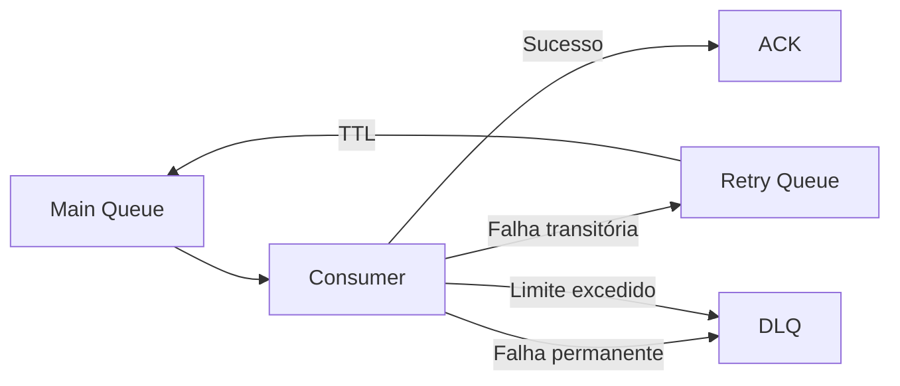

# ADR-013 - Dead Letter Queue

**Status:** Aceita

## Registro de Decisões

| ID | Decisão |
|---|---|
| D01 | O OrderFlow utilizará Dead Letter Queue para isolar mensagens que não puderem ser processadas com sucesso. |
| D02 | Toda fila principal possuirá uma DLQ correspondente. |
| D03 | Mensagens que excederem o limite máximo de tentativas serão encaminhadas para a DLQ. |
| D04 | Falhas permanentes poderão ser encaminhadas diretamente para a DLQ sem passar pelo fluxo de Retry. |
| D05 | A mensagem original deverá ser preservada, incluindo body, headers e propriedades AMQP. |
| D06 | A DLQ não será utilizada para reprocessamento automático. |
| D07 | O reprocessamento de mensagens da DLQ será manual em uma primeira etapa. |
| D08 | A infraestrutura deverá registrar logs quando uma mensagem for encaminhada para a DLQ. |
| D09 | A primeira implementação utilizará uma DLQ dedicada para cada fila principal. |
| D10 | A estratégia será compatível com o modelo de entrega At Least Once. |

## Escopo desta ADR

Esta ADR define a estratégia para armazenamento e tratamento de mensagens que não puderam ser processadas com sucesso após o fluxo de Retry ou que apresentem falhas permanentes.

Estão contemplados:

- conceito de Dead Letter Queue;
- critérios para envio de mensagens;
- preservação de metadados;
- responsabilidades da infraestrutura;
- estratégia inicial de reprocessamento.

Não fazem parte desta ADR:

- Retry;
- Inbox Pattern;
- Outbox Pattern;
- Idempotência;
- painel administrativo;
- reprocessamento automático;
- observabilidade.

> **Categoria:** Messaging / Reliability
>
> **Relacionadas:**
>
> - ADR-007 — RabbitMQ
> - ADR-012 — Retry
> - ADR-010 — Inbox Pattern
> - ADR-011 — Idempotência

---

# Contexto

Nem todas as mensagens conseguem ser processadas com sucesso.

Algumas falhas são transitórias e podem ser resolvidas com Retry.

Outras representam problemas permanentes, como:

- payload inválido;
- violação de regra de negócio;
- versão incompatível do contrato;
- inconsistência de dados.

Nesses casos, manter a mensagem retornando continuamente para a fila principal não agrega valor e compromete a estabilidade do sistema.

É necessário um mecanismo para remover essas mensagens do fluxo principal, preservando-as para análise posterior.

---

# Problema

Sem uma Dead Letter Queue, mensagens problemáticas podem:

- permanecer em ciclos infinitos;
- bloquear o processamento de novas mensagens;
- consumir recursos continuamente;
- dificultar diagnóstico;
- desaparecer caso sejam descartadas manualmente.

A solução deve permitir isolar essas mensagens sem comprometer o restante do processamento.

---

# Drivers Arquiteturais

## Confiabilidade

Mensagens não devem ser perdidas.

---

## Diagnóstico

Mensagens problemáticas devem permanecer disponíveis para investigação.

---

## Isolamento

Mensagens inválidas não devem permanecer interferindo no fluxo principal.

---

## Simplicidade Operacional

A primeira implementação privilegiará simplicidade.

O reprocessamento será manual.

---

## Baixo Acoplamento

Consumers concretos não conhecerão detalhes da DLQ.

Toda a decisão ficará centralizada na infraestrutura.

---

# Alternativas Consideradas

## Descartar a mensagem

**Vantagens**

- implementação simples.

**Desvantagens**

- perda definitiva da mensagem;
- inviabiliza auditoria.

**Decisão:** Rejeitada.

---

## Requeue infinito

**Vantagens**

- nenhuma perda imediata.

**Desvantagens**

- loop infinito;
- consumo excessivo;
- indisponibilidade parcial.

**Decisão:** Rejeitada.

---

## Dead Letter Queue

**Funcionamento**

```text
Consumer
    ↓
Erro permanente
    ↓
Dead Letter Queue
```

**Vantagens**

- preserva a mensagem;
- facilita investigação;
- reduz impacto operacional;
- integra-se naturalmente ao Retry.

**Desvantagens**

- aumenta a topologia;
- exige monitoramento.

**Decisão:** Aceita.

---

# Decisão

O OrderFlow utilizará uma Dead Letter Queue dedicada para armazenar mensagens que:

- excederem o limite de Retry;
- apresentarem falhas permanentes.

Essas mensagens não retornarão automaticamente ao fluxo principal.

---

# Topologia

Para o evento `order.created`:

```text
orderflow.order-created
```

Fila principal.

```text
orderflow.order-created.retry
```

Fila de Retry.

```text
orderflow.order-created.dlq
```

Dead Letter Queue.

---

# Fluxo Arquitetural



---

# Conteúdo da Mensagem

A mensagem enviada para a DLQ deverá preservar:

- Body;
- Headers;
- Routing Key;
- Exchange;
- Delivery Mode;
- CorrelationId;
- MessageId;
- Retry Count.

---

# Responsabilidades

## RabbitMqConsumerBase

Responsável por:

- identificar falhas permanentes;
- verificar limite de Retry;
- encaminhar mensagens para a DLQ;
- registrar logs;
- executar ACK ou NACK conforme necessário.

---

## Consumer

Responsável apenas pela lógica de negócio.

Não conhecerá:

- DLQ;
- Retry;
- TTL;
- Exchanges;
- Filas.

---

## RabbitMQ

Responsável por armazenar as mensagens encaminhadas para a Dead Letter Queue.

---

# Estratégia Inicial

A primeira versão não realizará reprocessamento automático.

O reenvio será manual após investigação.

---

# Consequências Positivas

- isolamento de mensagens inválidas;
- preservação de dados;
- facilidade de auditoria;
- preparação para ferramentas administrativas.

---

# Consequências Negativas

- aumento da topologia;
- necessidade de monitoramento;
- crescimento da quantidade de filas.

---

# Trade-offs

| Decisão | Benefício | Custo |
|---|---|---|
| DLQ dedicada | Melhor isolamento | Mais filas |
| Reprocessamento manual | Simplicidade | Intervenção operacional |
| Preservação de headers | Melhor diagnóstico | Maior volume de dados |

---

# Impacto nas Camadas

## Domain

Nenhum.

---

## Application

Nenhum.

---

## Infrastructure

Passará a ser responsável por:

- configuração da DLQ;
- publicação de mensagens;
- encaminhamento;
- logging.

---

## Worker.Payments

Continuará responsável apenas pelo processamento da mensagem.

---

# Critérios de Validação

A implementação será considerada concluída quando:

- mensagens permanentes forem encaminhadas para a DLQ;
- mensagens que excederem o Retry chegarem à DLQ;
- body e headers forem preservados;
- nenhuma mensagem permanecer em loop infinito;
- a mensagem puder ser visualizada no painel do RabbitMQ.

---

# Relação com outras ADRs

| ADR | Relação |
|---|---|
| ADR-007 | Infraestrutura RabbitMQ |
| ADR-012 | Define quando uma mensagem deve seguir para a DLQ |
| ADR-010 | Inbox Pattern protegerá contra duplicidade |
| ADR-011 | Idempotência necessária para reprocessamento |

---

# Referências

- RabbitMQ Documentation — Dead Letter Exchanges
- RabbitMQ Documentation — Consumer Acknowledgements
- Enterprise Integration Patterns
- Release It! — Michael T. Nygard

---

# Histórico

| Data | Alteração |
|---|---|
| 02/08/2026 | Criação da ADR-013 definindo a estratégia de Dead Letter Queue do OrderFlow. |