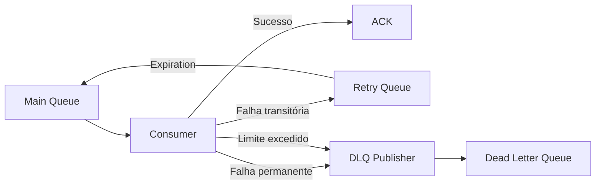

# ADR-013 - Dead Letter Queue

**Status:** Aceita

## Registro de Decisões

| ID | Decisão |
|---|---|
| D01 | O OrderFlow utilizará Dead Letter Queue para isolar mensagens que não puderem ser processadas com sucesso. |
| D02 | Toda fila principal possuirá uma DLQ correspondente. |
| D03 | Mensagens que excederem o limite máximo de tentativas de Retry serão publicadas na DLQ. |
| D04 | Falhas permanentes serão publicadas diretamente na DLQ, sem passar pelo fluxo de Retry. |
| D05 | A publicação para a DLQ preservará o body, os headers e as propriedades AMQP relevantes da mensagem original. |
| D06 | A DLQ não será utilizada para reprocessamento automático. |
| D07 | Quando necessário, o reprocessamento de mensagens da DLQ será iniciado manualmente após investigação da causa da falha; o procedimento operacional não faz parte da implementação atual. |
| D08 | A infraestrutura deverá registrar logs quando uma mensagem for encaminhada para a DLQ. |
| D09 | A primeira implementação utilizará uma DLQ dedicada para cada fila principal. |
| D10 | A estratégia será compatível com o modelo de entrega At Least Once. |
| D11 | A entrega original somente será confirmada após a confirmação da publicação da mensagem na DLQ. |

## Escopo desta ADR

Esta ADR define a estratégia para armazenamento e tratamento de mensagens que não puderam ser processadas com sucesso após o fluxo de Retry ou que apresentem falhas permanentes.

Estão contemplados:

- conceito de Dead Letter Queue;
- critérios para envio de mensagens;
- preservação de metadados;
- responsabilidades da infraestrutura;
- estratégia inicial de reprocessamento.

Não fazem parte desta ADR:

- Retry;
- Inbox Pattern;
- Outbox Pattern;
- Idempotência;
- painel administrativo;
- reprocessamento automático;
- observabilidade.

> **Categoria:** Messaging / Reliability
>
> **Relacionadas:**
>
> - ADR-007 — RabbitMQ
> - ADR-012 — Retry
> - ADR-010 — Inbox Pattern
> - ADR-011 — Idempotência

---

# Contexto

Nem todas as mensagens conseguem ser processadas com sucesso.

Algumas falhas são transitórias e podem ser resolvidas com Retry.

Outras representam problemas permanentes, como:

- payload inválido;
- violação permanente de regra de negócio;
- versão incompatível do contrato;
- inconsistência de dados.

Nesses casos, manter a mensagem retornando continuamente para a fila principal não agrega valor e compromete a estabilidade do sistema.

É necessário um mecanismo para remover essas mensagens do fluxo principal, preservando-as para análise posterior.

---

# Problema

Sem uma Dead Letter Queue, mensagens problemáticas podem:

- permanecer em ciclos infinitos;
- bloquear o processamento de novas mensagens;
- consumir recursos continuamente;
- dificultar diagnóstico;
- desaparecer caso sejam descartadas manualmente.

A solução deve permitir isolar essas mensagens sem comprometer o restante do processamento.

---

# Drivers Arquiteturais

## Confiabilidade

Mensagens não devem ser perdidas.

---

## Diagnóstico

Mensagens problemáticas devem permanecer disponíveis para investigação.

---

## Isolamento

Mensagens que não puderem ser processadas não devem permanecer interferindo no fluxo principal.

---

## Simplicidade Operacional

A primeira implementação privilegiará simplicidade.

Quando necessário, o reprocessamento será iniciado manualmente após a investigação da causa da falha.

O procedimento operacional de reprocessamento será definido em evolução posterior.

---

## Baixo Acoplamento

Consumers concretos não conhecerão detalhes da DLQ.

Toda a decisão ficará centralizada na infraestrutura.

---

# Alternativas Consideradas

## Descartar a mensagem

**Vantagens**

- implementação simples.

**Desvantagens**

- perda definitiva da mensagem;
- inviabiliza auditoria.

**Decisão:** Rejeitada.

---

## Requeue infinito

**Vantagens**

- nenhuma perda imediata.

**Desvantagens**

- loop infinito;
- consumo excessivo;
- indisponibilidade parcial.

**Decisão:** Rejeitada.

---

## Dead Letter Queue

**Funcionamento**

```text
Consumer
    ↓
Erro permanente
    ↓
Dead Letter Queue
```

**Vantagens**

- preserva a mensagem;
- facilita investigação;
- reduz impacto operacional;
- integra-se naturalmente ao Retry.

**Desvantagens**

- aumenta a topologia;
- exige monitoramento.

**Decisão:** Aceita.

---

# Decisão

O OrderFlow utilizará uma Dead Letter Queue dedicada para armazenar mensagens que:

- excederem o limite máximo de Retry;
- apresentarem falhas permanentes.

Falhas permanentes serão publicadas diretamente na DLQ, sem passar pela Retry Queue.

Quando o limite máximo de Retry for excedido, a mensagem também será publicada na DLQ.

Em ambos os casos, a entrega original somente receberá `ACK` após a confirmação da publicação na DLQ.

Essas mensagens não retornarão automaticamente ao fluxo principal.

---

# Topologia

Para o evento `order.created`:

```text
orderflow.order-created
```

Fila principal.

```text
orderflow.order-created.retry
```

Fila de Retry.

```text
orderflow.order-created.dlq
```

Dead Letter Queue.

---

# Fluxo Arquitetural



---

# Conteúdo da Mensagem

A publicação para a DLQ deverá preservar, quando presentes:

- Body;
- Headers;
- Delivery Mode;
- CorrelationId;
- MessageId;
- Retry Count;
- demais propriedades AMQP relevantes da mensagem original.

A publicação utilizará a exchange e a routing key definidas para o fluxo de DLQ.

---

# Publicação e Confirmação

O encaminhamento para a DLQ será realizado por meio de uma nova publicação utilizando a routing key destinada à Dead Letter Queue.

O fluxo será:

1. identificar que a mensagem deve ser enviada para a DLQ;
2. publicar a mensagem utilizando a routing key da DLQ;
3. aguardar a confirmação da publicação;
4. executar o `ACK` da entrega original.

Caso a publicação na DLQ falhe, o `ACK` da entrega original não deverá ser realizado.

Essa ordem reduz o risco de perda da mensagem entre o processamento da entrega original e sua publicação na Dead Letter Queue.

---

# Responsabilidades

## RabbitMqConsumerBase

Responsável por:

- identificar falhas permanentes;
- verificar o limite de Retry;
- publicar mensagens na DLQ;
- preservar os metadados relevantes da mensagem original;
- aguardar a confirmação da publicação;
- executar `ACK` da entrega original somente após a publicação confirmada;
- registrar logs do encaminhamento para a DLQ.

---

## Consumer

Responsável pela lógica específica de processamento e validação da mensagem.

Não conhecerá:

- DLQ;
- Retry;
- cálculo de backoff;
- `Expiration`;
- Exchanges;
- Filas;
- ACK;
- republicação.

---

## RabbitMQ

Responsável por:

- armazenar as mensagens publicadas na Dead Letter Queue;
- manter as mensagens isoladas do fluxo principal;
- preservar as mensagens na DLQ até que exista uma ação operacional de reprocessamento ou remoção.
---

# Estratégia Inicial

A primeira versão não realizará reprocessamento automático das mensagens armazenadas na DLQ.

As mensagens permanecerão isoladas até que sejam analisadas.

Quando necessário, o reprocessamento será iniciado manualmente após a investigação da causa da falha.

A definição do procedimento operacional de reprocessamento manual será tratada como evolução posterior e não faz parte da implementação atual.

---

# Consequências Positivas

- isolamento de mensagens que não puderam ser processadas;
- preservação da mensagem e de seus metadados relevantes;
- proteção do fluxo principal contra mensagens problemáticas;
- facilidade de investigação e diagnóstico;
- possibilidade de reprocessamento posterior;
- preparação para ferramentas administrativas e operacionais.

---

# Consequências Negativas

- aumento da complexidade da topologia RabbitMQ;
- crescimento da quantidade de filas;
- necessidade de monitoramento da DLQ;
- necessidade de investigação operacional das mensagens isoladas;
- necessidade de definir um procedimento seguro para reprocessamento manual;
- possibilidade de crescimento da DLQ caso as mensagens não sejam tratadas.

---

# Trade-offs

| Decisão | Benefício | Custo |
|---|---|---|
| DLQ dedicada por fila principal | Melhor isolamento e identificação da origem | Maior quantidade de filas |
| Publicação explícita na DLQ | Controle sobre o destino e confirmação da publicação | Maior responsabilidade da infraestrutura |
| ACK após publicação confirmada | Reduz o risco de perda da mensagem | Maior complexidade no fluxo de confirmação |
| Reprocessamento manual | Evita reintrodução automática de mensagens problemáticas | Exige intervenção operacional |
| Preservação de metadados | Facilita investigação e diagnóstico | Maior volume de informações mantidas |

---

# Impacto nas Camadas

## Domain

Nenhum.

---

## Application

Nenhum.

---

## Infrastructure

É responsável por:

- configuração da DLQ;
- publicação das mensagens destinadas à DLQ;
- preservação dos metadados relevantes da mensagem original;
- confirmação da publicação antes do `ACK` da entrega original;
- encaminhamento de falhas permanentes e mensagens que excederem o limite de Retry;
- logging do fluxo de envio para a DLQ.

---

## Worker.Payments

Continuará responsável pela lógica específica de processamento e validação das mensagens de pagamento.

---

# Critérios de Validação

A implementação será considerada concluída quando:

- falhas permanentes forem publicadas diretamente na DLQ, sem passar pelo Retry;
- mensagens que excederem o limite máximo de Retry forem publicadas na DLQ;
- a publicação na DLQ for confirmada antes do `ACK` da entrega original;
- body, headers e propriedades AMQP relevantes forem preservados;
- mensagens encaminhadas para a DLQ não retornarem automaticamente ao fluxo principal;
- as mensagens permanecerem disponíveis para inspeção na Dead Letter Queue;
- o encaminhamento para a DLQ for registrado em log.

---

# Relação com outras ADRs

| ADR | Relação |
|---|---|
| ADR-007 | Infraestrutura RabbitMQ |
| ADR-012 | Define quando uma mensagem deve seguir para a DLQ |
| ADR-010 | Inbox Pattern protege contra duplicidade |
| ADR-011 | Idempotência necessária para reprocessamento |

---

# Referências

- RabbitMQ Documentation — Dead Letter Exchanges
- RabbitMQ Documentation — Consumer Acknowledgements
- Enterprise Integration Patterns
- Release It! — Michael T. Nygard

---

# Histórico

| Data | Alteração |
|---|---|
| 02/08/2026 | Criação da ADR-013 definindo a estratégia de Dead Letter Queue do OrderFlow. |
| 13/09/2026 | Atualização da estratégia de DLQ com publicação explícita, confirmação da publicação antes do ACK, preservação de metadados e tratamento direto de falhas permanentes. |