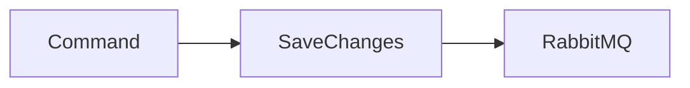
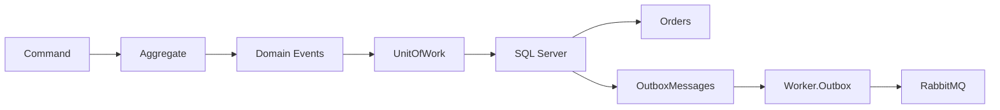
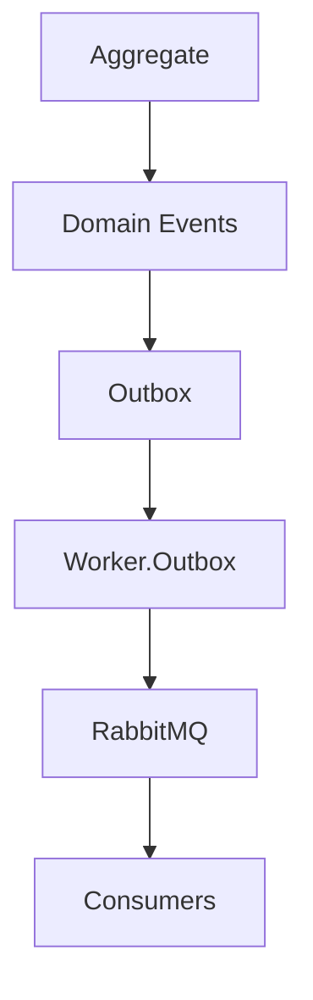

# Outbox Pattern

## Objetivo

Este documento apresenta o **Outbox Pattern**, um dos padrões arquiteturais mais utilizados em sistemas distribuídos orientados a eventos.

O objetivo é compreender:

- qual problema o Outbox resolve;
- por que ele é necessário;
- como funciona internamente;
- como será implementado no OrderFlow;
- quais são suas vantagens e limitações.

---

# O problema

Imagine o fluxo abaixo.

```text
Criar Pedido

↓

Salvar no banco

↓

Publicar evento no RabbitMQ
```

À primeira vista parece correto.

Entretanto existe um problema.

Considere o seguinte cenário:

```text
SaveChanges()

↓

Commit realizado

↓

RabbitMQ indisponível
```

Resultado:

```text
Pedido salvo

Evento perdido
```

O sistema ficou inconsistente.

O banco informa que existe um pedido.

Os consumidores jamais serão notificados.

Esse problema é conhecido como **Dual Write Problem**.

---

# O que é o Dual Write Problem?

Sempre que uma aplicação precisa atualizar dois recursos independentes existe risco de inconsistência.

Exemplo:

```text
Banco de Dados

+

RabbitMQ
```

São dois sistemas diferentes.

Não existe uma transação única envolvendo ambos.

Logo:

```text
Banco
✔

RabbitMQ
❌
```

é perfeitamente possível.

---

# O que é o Outbox Pattern?

O Outbox Pattern elimina esse problema.

Ao invés de publicar diretamente no RabbitMQ, o evento é salvo em uma tabela chamada **OutboxMessages**.

Tudo ocorre dentro da mesma transação.

```text
Transaction

Orders

OutboxMessages

Commit
```

Somente depois:

```text
Worker.Outbox

↓

RabbitMQ
```

---

# Fluxo sem Outbox



Problema:

```text
SaveChanges()

↓

RabbitMQ indisponível
```

Evento perdido.

---

# Fluxo com Outbox



---

# Como funciona?

## Etapa 1

O Aggregate gera um Domain Event.

```text
OrderCreated
```

---

## Etapa 2

O UnitOfWork salva:

- Orders
- OutboxMessages

na mesma transação.

---

## Etapa 3

A transação é confirmada.

```text
Commit
```

---

## Etapa 4

O Worker.Outbox consulta:

```sql
Processed = false
```

---

## Etapa 5

Cada evento é publicado.

```text
RabbitMQ
```

---

## Etapa 6

Após publicação com sucesso:

```text
Processed = true
```

---

# Arquitetura



---

# Worker.Outbox

O Worker será responsável por:

- consultar eventos pendentes;
- publicar eventos;
- marcar eventos como processados;
- registrar logs;
- realizar novas tentativas em caso de falha.

---

# Benefícios

## Confiabilidade

Nenhum evento é perdido.

---

## Recuperação

Caso o RabbitMQ esteja indisponível:

```text
Eventos continuam na Outbox
```

---

## Escalabilidade

O Worker pode publicar milhares de eventos independentemente da API.

---

## Desacoplamento

A API não depende da disponibilidade do RabbitMQ.

---

# Desvantagens

- tabela adicional;
- Worker adicional;
- necessidade de limpeza periódica;
- pequeno aumento da complexidade.

---

# Comparação

## Publicação direta

```text
Order

↓

RabbitMQ
```

Risco de perda.

---

## Outbox

```text
Order

↓

Outbox

↓

RabbitMQ
```

Sem perda de mensagens.

---

# Relação com Domain Events

O Outbox não substitui Domain Events.

Na verdade:

```text
Aggregate

↓

Domain Event

↓

Outbox
```

Os Domain Events continuam sendo a origem dos eventos.

---

# Relação com RabbitMQ

O RabbitMQ deixa de ser chamado pela API.

Passa a receber mensagens apenas do:

```text
Worker.Outbox
```

---

# Relação com Retry

Retry continua existindo.

Entretanto agora teremos dois tipos de Retry.

## Retry da publicação

Worker.Outbox.

---

## Retry do consumo

Worker.Payments.

São responsabilidades diferentes.

---

# Relação com Dead Letter Queue

A DLQ continua pertencendo ao consumo.

```text
RabbitMQ

↓

Worker.Payments

↓

DLQ
```

O Outbox não utiliza DLQ.

---

# Relação com Inbox Pattern

Mais adiante teremos:

```text
Outbox

↓

RabbitMQ

↓

Inbox

↓

Application
```

Os dois padrões normalmente são utilizados em conjunto.

---

# Quando utilizar?

O Outbox é recomendado quando:

- existe Event-Driven Architecture;
- há integração entre sistemas;
- não se pode perder mensagens;
- existe comunicação assíncrona.

---

# Quando não utilizar?

Pode não ser necessário quando:

- a aplicação é monolítica;
- não há mensageria;
- eventual perda de eventos é aceitável.

---

# Como será implementado no OrderFlow?

A implementação seguirá as etapas:

1. Entidade OutboxMessage.
2. Tabela OutboxMessages.
3. Mapping EF Core.
4. Migration.
5. Ajuste do UnitOfWork.
6. Worker.Outbox.
7. Publicação.
8. Marcação como Processado.
9. Retry.
10. Testes.

---

# Resumo

O Outbox Pattern resolve o problema conhecido como **Dual Write**, garantindo que eventos nunca sejam perdidos entre a persistência do banco de dados e a publicação para o RabbitMQ.

A estratégia consiste em persistir os eventos na mesma transação do agregado e delegar sua publicação para um Worker dedicado.

Essa abordagem fornece alta confiabilidade, desacoplamento e recuperação automática, sendo amplamente utilizada em sistemas distribuídos de missão crítica.