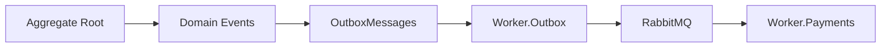

# DEC-007 - Por que Outbox Pattern?

## Objetivo

Explicar por que o OrderFlow utiliza o **Transactional Outbox Pattern** para publicação de eventos de domínio.

---

# Problema

Em aplicações orientadas a eventos, normalmente um caso de uso executa duas operações independentes:

1. Persistir os dados no banco de dados.
2. Publicar um evento no broker de mensagens.

Embora essas operações representem um único processo de negócio, elas não fazem parte da mesma transação.

Considere o fluxo:

```text
Salvar Pedido

↓

Commit

↓

Publicar Evento
```

Caso o banco confirme a transação e o RabbitMQ fique indisponível imediatamente após o commit, o pedido será persistido, porém o evento será perdido.

Essa situação é conhecida como **Dual Write Problem**.

---

# Solução

O Transactional Outbox Pattern elimina esse risco.

Em vez de publicar diretamente no RabbitMQ, a aplicação grava o evento em uma tabela Outbox durante a mesma transação utilizada para persistir o agregado.

Após o commit, um Worker dedicado realiza a publicação dos eventos pendentes.

```text
Transaction

Orders

OutboxMessages

Commit

↓

Worker.Outbox

↓

RabbitMQ
```

---

# Benefícios

A adoção do Outbox oferece diversas vantagens:

- elimina perda de eventos;
- desacopla persistência da publicação;
- melhora a confiabilidade da solução;
- permite recuperação automática após falhas;
- reduz dependência da disponibilidade imediata do RabbitMQ.

---

# Impacto no OrderFlow

Com a adoção do Outbox:

- a API deixa de publicar diretamente no RabbitMQ;
- os Domain Events passam a ser persistidos juntamente com o agregado;
- o Worker.Outbox torna-se responsável pela publicação;
- o Worker.Payments continua responsável apenas pelo consumo das mensagens.

Cada componente permanece responsável por uma única etapa do fluxo.

---

# Fluxo



---

# Trade-offs

A implementação introduz:

- uma tabela adicional;
- um Worker adicional;
- maior complexidade operacional.

Em contrapartida, elimina um dos principais problemas encontrados em sistemas distribuídos: a perda de eventos entre a persistência e a publicação.

---

# Conclusão

O Transactional Outbox Pattern foi escolhido por fornecer uma solução simples, robusta e amplamente adotada para garantir a publicação confiável de eventos em arquiteturas orientadas a mensagens.

No OrderFlow, ele representa a evolução natural da infraestrutura de mensageria já construída com Domain Events, RabbitMQ, Retry e Dead Letter Queue.