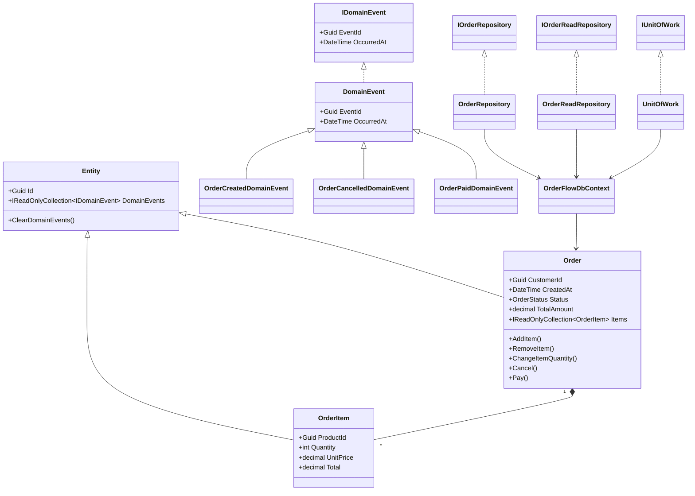

# Arquitetura Geral

Este diagrama representa a arquitetura atual do **OrderFlow**, contemplando o modelo de domínio, a camada de aplicação e a infraestrutura de persistência implementada até o momento.

