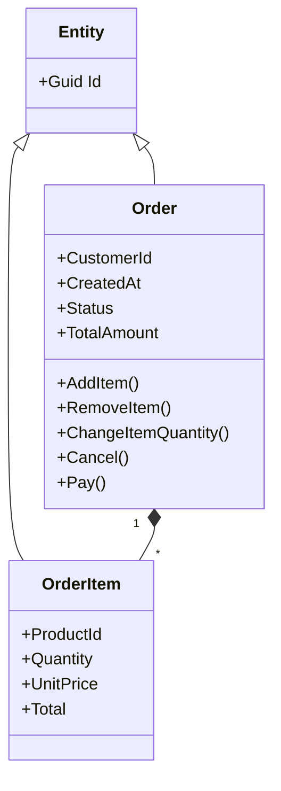

# Arquitetura Geral

```mermaid
classDiagram

Entity <|-- Order
Entity <|-- OrderItem

Order "1" *-- "*" OrderItem

class Entity{
    +Guid Id
}

class Order{
    +CustomerId
    +CreatedAt
    +Status
    +TotalAmount
    +AddItem()
    +RemoveItem()
    +ChangeItemQuantity()
    +Cancel()
    +Pay()
}

class OrderItem{
    +ProductId
    +Quantity
    +UnitPrice
    +Total
}
```