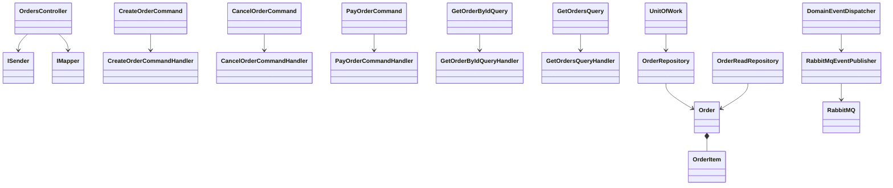
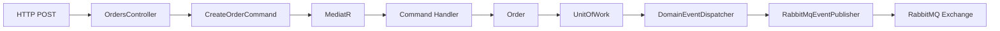
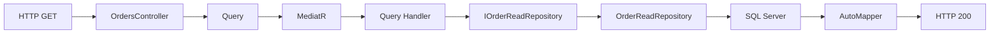
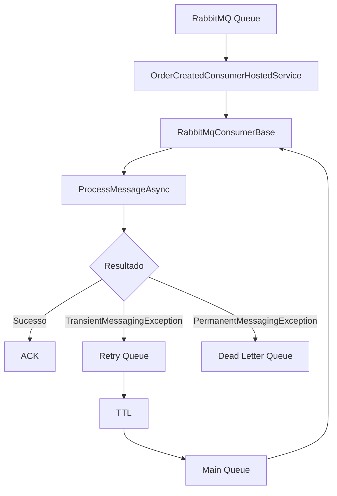
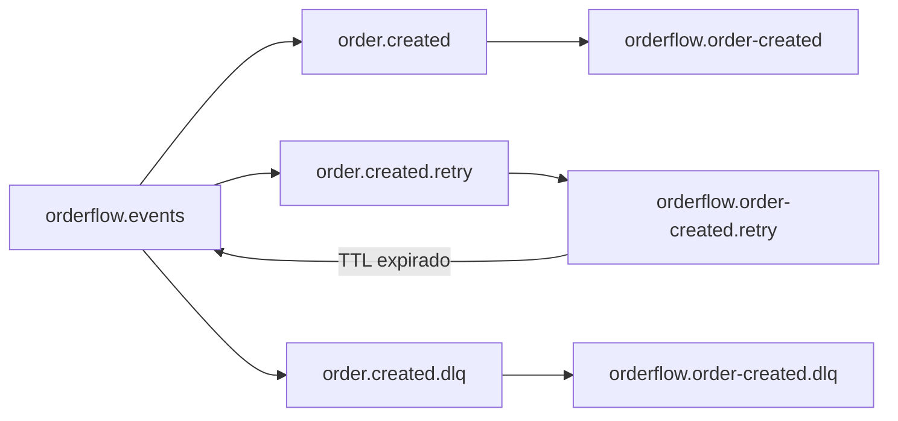
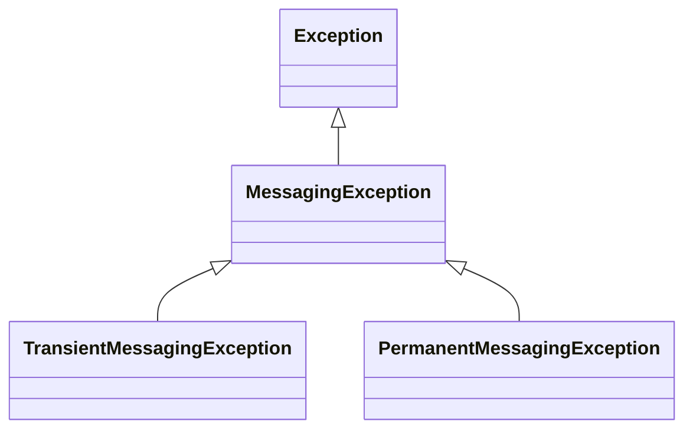
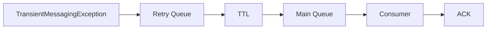
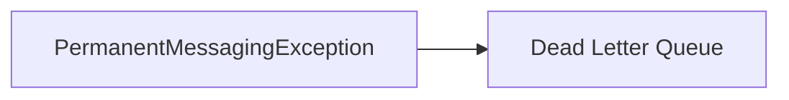

# Arquitetura Geral

## Visão Geral

O **OrderFlow** é um laboratório de arquitetura distribuída desenvolvido em **.NET 10**, cujo objetivo é demonstrar a implementação prática de padrões utilizados em sistemas corporativos modernos.

A solução foi construída seguindo os princípios de:

- Clean Architecture
- Domain-Driven Design (DDD)
- CQRS
- Domain Events
- Repository Pattern
- Unit of Work
- RabbitMQ
- Event-Driven Architecture
- Worker Pattern
- Retry
- Dead Letter Queue (DLQ)

A arquitetura mantém forte separação entre regras de negócio e infraestrutura, permitindo baixo acoplamento, alta coesão e facilidade de evolução.

---

# Visão Arquitetural

```mermaid
classDiagram

%% API

class OrdersController
class ISender
class IMapper

OrdersController --> ISender
OrdersController --> IMapper

%% APPLICATION

class CreateOrderCommand
class CancelOrderCommand
class PayOrderCommand

class CreateOrderCommandHandler
class CancelOrderCommandHandler
class PayOrderCommandHandler

CreateOrderCommand --> CreateOrderCommandHandler
CancelOrderCommand --> CancelOrderCommandHandler
PayOrderCommand --> PayOrderCommandHandler

class GetOrderByIdQuery
class GetOrdersQuery

class GetOrderByIdQueryHandler
class GetOrdersQueryHandler

GetOrderByIdQuery --> GetOrderByIdQueryHandler
GetOrdersQuery --> GetOrdersQueryHandler

%% DOMAIN

class Order
class OrderItem

Order *-- OrderItem

%% INFRASTRUCTURE

class OrderRepository
class OrderReadRepository
class UnitOfWork
class DomainEventDispatcher
class RabbitMqEventPublisher

OrderRepository --> Order
OrderReadRepository --> Order
UnitOfWork --> OrderRepository

DomainEventDispatcher --> RabbitMqEventPublisher

class RabbitMQ

RabbitMqEventPublisher --> RabbitMQ
```

---

# Arquitetura dos Workers

```mermaid
classDiagram

class OrderFlowWorkerPayments

class OrderCreatedConsumerHostedService

class RabbitMqConsumerBase~TMessage~

class OrderCreatedConsumer

OrderFlowWorkerPayments
--> OrderCreatedConsumerHostedService

OrderCreatedConsumerHostedService
--> OrderCreatedConsumer

RabbitMqConsumerBase <|-- OrderCreatedConsumer
```

---

# Fluxo de Escrita (CQRS)

```mermaid
flowchart LR

A[HTTP POST]
--> B[OrdersController]
--> C[CreateOrderCommand]
--> D[MediatR]
--> E[Command Handler]
--> F[Order]
--> G[UnitOfWork]
--> H[DomainEventDispatcher]
--> I[RabbitMqEventPublisher]
--> J[RabbitMQ Exchange]
```

---

# Fluxo de Leitura (CQRS)

```mermaid
flowchart LR

A[HTTP GET]
--> B[OrdersController]
--> C[Query]
--> D[MediatR]
--> E[Query Handler]
--> F[IOrderReadRepository]
--> G[OrderReadRepository]
--> H[SQL Server]
--> I[AutoMapper]
--> J[HTTP 200]
```

---

# Fluxo de Processamento Assíncrono

```mermaid
flowchart TD

A[RabbitMQ Queue]
--> B[OrderCreatedConsumerHostedService]
--> C[RabbitMqConsumerBase]
--> D[ProcessMessageAsync]

D --> E{Resultado}

E -->|Sucesso| F[ACK]

E -->|TransientMessagingException| G[Retry Queue]

G --> H[TTL]

H --> I[Main Queue]

I --> C

E -->|PermanentMessagingException| J[Dead Letter Queue]
```

---

# Topologia RabbitMQ

```mermaid
flowchart LR

A[orderflow.events]

A --> B[order.created]
B --> C[orderflow.order-created]

A --> D[order.created.retry]
D --> E[orderflow.order-created.retry]

A --> F[order.created.dlq]
F --> G[orderflow.order-created.dlq]

E -->|TTL expirado| A
```

---

# Hierarquia das Exceções

```mermaid
classDiagram

Exception <|-- MessagingException

MessagingException <|-- TransientMessagingException

MessagingException <|-- PermanentMessagingException
```

---

# Fluxo de Retry

```mermaid
flowchart LR

A[TransientMessagingException]
--> B[Retry Queue]
--> C[TTL]
--> D[Main Queue]
--> E[Consumer]
--> F[ACK]
```

---

# Fluxo de Dead Letter Queue

```mermaid
flowchart LR

A[PermanentMessagingException]
--> B[Dead Letter Queue]
```

---

# Responsabilidades das Camadas

| Camada | Responsabilidade |
|---------|------------------|
| **Api** | Receber requisições HTTP, mapear contratos, enviar Commands e Queries e produzir respostas HTTP. |
| **Application** | Orquestrar casos de uso, validar entradas e depender apenas de abstrações. |
| **Domain** | Concentrar entidades, regras de negócio, invariantes, transições de estado e Domain Events. |
| **Infrastructure** | Implementar persistência, SQL Server, Unit of Work, RabbitMQ, Retry, Dead Letter Queue, Workers e integrações externas. |

---

# Princípios Arquiteturais

A arquitetura do OrderFlow foi construída utilizando os seguintes padrões:

- Clean Architecture
- Domain-Driven Design (DDD)
- CQRS
- Domain Events
- Repository Pattern
- Unit of Work
- Dependency Injection
- RabbitMQ
- Event-Driven Architecture
- Worker Pattern
- Retry
- Dead Letter Queue (DLQ)

---

# Observações Arquiteturais

A camada **Domain** permanece completamente independente de frameworks, banco de dados, HTTP ou RabbitMQ.

A camada **Application** depende apenas de abstrações, preservando o desacoplamento entre regras de negócio e infraestrutura.

Toda a infraestrutura de mensageria está centralizada na camada **Infrastructure**.

O `RabbitMqConsumerBase<TMessage>` concentra toda a política de processamento de mensagens, incluindo:

- desserialização;
- ACK;
- Retry;
- Dead Letter Queue;
- republicação;
- controle do header `x-orderflow-retry-count`;
- classificação entre falhas transitórias e permanentes.

Os Consumers concretos permanecem responsáveis exclusivamente pela lógica de negócio, desconhecendo detalhes de infraestrutura como ACK, Retry, DLQ e republicação de mensagens.

> **Próxima evolução arquitetural:** implementação do **Transactional Outbox Pattern**, eliminando a possibilidade de perda de eventos entre a persistência no banco de dados e a publicação no RabbitMQ.