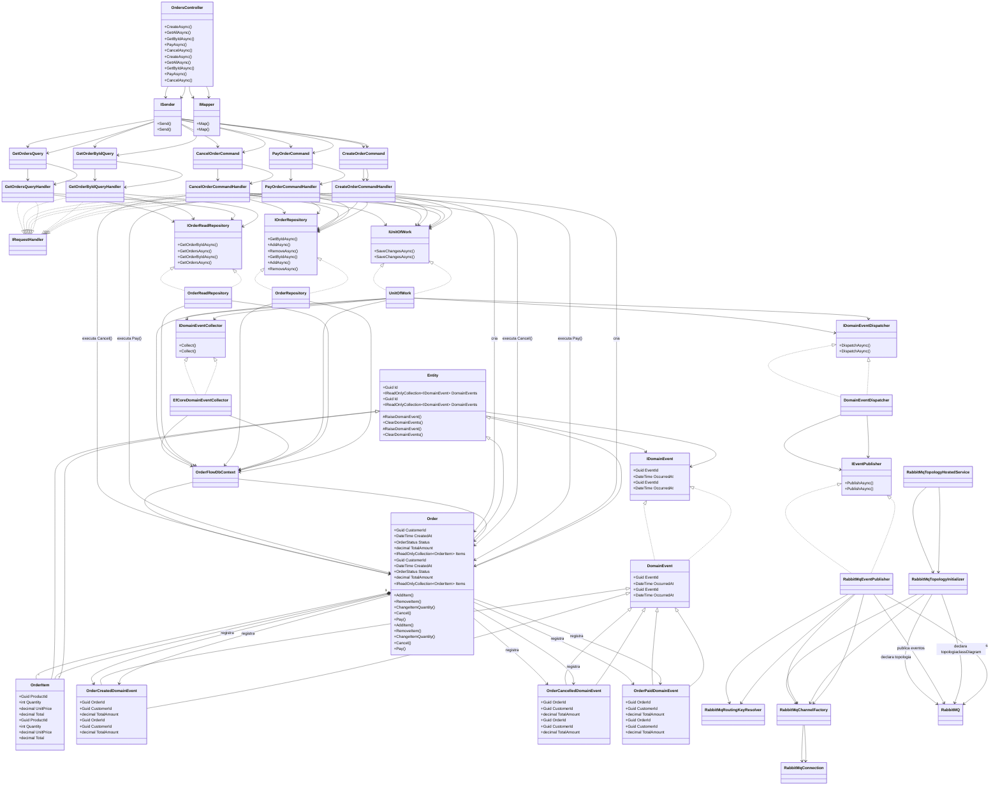

# Arquitetura Geral

Este diagrama representa a arquitetura atual do **OrderFlow**, destacando a organização das camadas **Domain**, **Application** e **Infrastructure**, bem como os principais componentes e seus relacionamentos.

A arquitetura segue os princípios de **Clean Architecture**, **Domain-Driven Design (DDD)** e **CQRS**, mantendo a separação de responsabilidades entre as camadas e o baixo acoplamento entre seus componentes.

```mermaid
classDiagram

%% ==========================
%% API
%% ==========================

class OrdersController {
    +CreateAsync()
    +GetAllAsync()
    +GetByIdAsync()
    +PayAsync()
    +CancelAsync()
}

class ISender {
    +Send()
}

class IMapper {
    +Map()
}

OrdersController --> ISender
OrdersController --> IMapper

%% ==========================
%% APPLICATION - COMMANDS
%% ==========================

class CreateOrderCommand
class PayOrderCommand
class CancelOrderCommand

class CreateOrderCommandHandler
class PayOrderCommandHandler
class CancelOrderCommandHandler

CreateOrderCommandHandler ..|> IRequestHandler
PayOrderCommandHandler ..|> IRequestHandler
CancelOrderCommandHandler ..|> IRequestHandler

ISender --> CreateOrderCommand
ISender --> PayOrderCommand
ISender --> CancelOrderCommand

CreateOrderCommand --> CreateOrderCommandHandler
PayOrderCommand --> PayOrderCommandHandler
CancelOrderCommand --> CancelOrderCommandHandler

%% ==========================
%% APPLICATION - QUERIES
%% ==========================

class GetOrderByIdQuery
class GetOrdersQuery

class GetOrderByIdQueryHandler
class GetOrdersQueryHandler

GetOrderByIdQueryHandler ..|> IRequestHandler
GetOrdersQueryHandler ..|> IRequestHandler

ISender --> GetOrderByIdQuery
ISender --> GetOrdersQuery

GetOrderByIdQuery --> GetOrderByIdQueryHandler
GetOrdersQuery --> GetOrdersQueryHandler

%% ==========================
%% APPLICATION - ABSTRACTIONS
%% ==========================

class IOrderRepository {
    +GetByIdAsync()
    +AddAsync()
    +RemoveAsync()
}

class IOrderReadRepository {
    +GetOrderByIdAsync()
    +GetOrdersAsync()
}

class IUnitOfWork {
    +SaveChangesAsync()
}

class IDomainEventCollector {
    +Collect()
}

class IDomainEventDispatcher {
    +DispatchAsync()
}

class IEventPublisher {
    +PublishAsync()
}

CreateOrderCommandHandler --> IOrderRepository
CreateOrderCommandHandler --> IUnitOfWork

PayOrderCommandHandler --> IOrderRepository
PayOrderCommandHandler --> IUnitOfWork

CancelOrderCommandHandler --> IOrderRepository
CancelOrderCommandHandler --> IUnitOfWork

GetOrderByIdQueryHandler --> IOrderReadRepository
GetOrdersQueryHandler --> IOrderReadRepository

%% ==========================
%% DOMAIN
%% ==========================

Entity <|-- Order
Entity <|-- OrderItem

Order "1" *-- "*" OrderItem

class Entity {
    +Guid Id
    +IReadOnlyCollection~IDomainEvent~ DomainEvents
    #RaiseDomainEvent()
    +ClearDomainEvents()
}

class Order {
    +Guid CustomerId
    +DateTime CreatedAt
    +OrderStatus Status
    +decimal TotalAmount
    +IReadOnlyCollection~OrderItem~ Items
    +AddItem()
    +RemoveItem()
    +ChangeItemQuantity()
    +Cancel()
    +Pay()
}

class OrderItem {
    +Guid ProductId
    +int Quantity
    +decimal UnitPrice
    +decimal Total
}

CreateOrderCommandHandler --> Order : cria
PayOrderCommandHandler --> Order : executa Pay()
CancelOrderCommandHandler --> Order : executa Cancel()

%% ==========================
%% DOMAIN EVENTS
%% ==========================

class IDomainEvent {
    +Guid EventId
    +DateTime OccurredAt
}

class DomainEvent {
    +Guid EventId
    +DateTime OccurredAt
}

class OrderCreatedDomainEvent {
    +Guid OrderId
    +Guid CustomerId
    +decimal TotalAmount
}

class OrderCancelledDomainEvent {
    +Guid OrderId
    +Guid CustomerId
    +decimal TotalAmount
}

class OrderPaidDomainEvent {
    +Guid OrderId
    +Guid CustomerId
    +decimal TotalAmount
}

IDomainEvent <|.. DomainEvent

DomainEvent <|-- OrderCreatedDomainEvent
DomainEvent <|-- OrderCancelledDomainEvent
DomainEvent <|-- OrderPaidDomainEvent

Entity --> IDomainEvent
Order --> OrderCreatedDomainEvent : registra
Order --> OrderCancelledDomainEvent : registra
Order --> OrderPaidDomainEvent : registra

%% ==========================
%% INFRASTRUCTURE - PERSISTENCE
%% ==========================

class OrderFlowDbContext

class OrderRepository
class OrderReadRepository
class UnitOfWork
class EfCoreDomainEventCollector

IOrderRepository <|.. OrderRepository
IOrderReadRepository <|.. OrderReadRepository
IUnitOfWork <|.. UnitOfWork
IDomainEventCollector <|.. EfCoreDomainEventCollector

OrderRepository --> OrderFlowDbContext
OrderReadRepository --> OrderFlowDbContext
UnitOfWork --> OrderFlowDbContext
EfCoreDomainEventCollector --> OrderFlowDbContext

OrderFlowDbContext --> Order
UnitOfWork --> IDomainEventCollector
UnitOfWork --> IDomainEventDispatcher

%% ==========================
%% INFRASTRUCTURE - RABBITMQ
%% ==========================

class DomainEventDispatcher
class RabbitMqEventPublisher
class RabbitMqRoutingKeyResolver
class RabbitMqChannelFactory
class RabbitMqConnection
class RabbitMqTopologyInitializer
class RabbitMqTopologyHostedService
class RabbitMQ

IDomainEventDispatcher <|.. DomainEventDispatcher
IEventPublisher <|.. RabbitMqEventPublisher

DomainEventDispatcher --> IEventPublisher

RabbitMqEventPublisher --> RabbitMqRoutingKeyResolver
RabbitMqEventPublisher --> RabbitMqChannelFactory

RabbitMqChannelFactory --> RabbitMqConnection

RabbitMqTopologyHostedService --> RabbitMqTopologyInitializer
RabbitMqTopologyInitializer --> RabbitMqChannelFactory

RabbitMqEventPublisher --> RabbitMQ : publica eventos
RabbitMqTopologyInitializer --> RabbitMQ : declara topologiaclassDiagram

%% ==========================
%% API
%% ==========================

class OrdersController {
    +CreateAsync()
    +GetAllAsync()
    +GetByIdAsync()
    +PayAsync()
    +CancelAsync()
}

class ISender {
    +Send()
}

class IMapper {
    +Map()
}

OrdersController --> ISender
OrdersController --> IMapper

%% ==========================
%% APPLICATION - COMMANDS
%% ==========================

class CreateOrderCommand
class PayOrderCommand
class CancelOrderCommand

class CreateOrderCommandHandler
class PayOrderCommandHandler
class CancelOrderCommandHandler

CreateOrderCommandHandler ..|> IRequestHandler
PayOrderCommandHandler ..|> IRequestHandler
CancelOrderCommandHandler ..|> IRequestHandler

ISender --> CreateOrderCommand
ISender --> PayOrderCommand
ISender --> CancelOrderCommand

CreateOrderCommand --> CreateOrderCommandHandler
PayOrderCommand --> PayOrderCommandHandler
CancelOrderCommand --> CancelOrderCommandHandler

%% ==========================
%% APPLICATION - QUERIES
%% ==========================

class GetOrderByIdQuery
class GetOrdersQuery

class GetOrderByIdQueryHandler
class GetOrdersQueryHandler

GetOrderByIdQueryHandler ..|> IRequestHandler
GetOrdersQueryHandler ..|> IRequestHandler

ISender --> GetOrderByIdQuery
ISender --> GetOrdersQuery

GetOrderByIdQuery --> GetOrderByIdQueryHandler
GetOrdersQuery --> GetOrdersQueryHandler

%% ==========================
%% APPLICATION - ABSTRACTIONS
%% ==========================

class IOrderRepository {
    +GetByIdAsync()
    +AddAsync()
    +RemoveAsync()
}

class IOrderReadRepository {
    +GetOrderByIdAsync()
    +GetOrdersAsync()
}

class IUnitOfWork {
    +SaveChangesAsync()
}

class IDomainEventCollector {
    +Collect()
}

class IDomainEventDispatcher {
    +DispatchAsync()
}

class IEventPublisher {
    +PublishAsync()
}

CreateOrderCommandHandler --> IOrderRepository
CreateOrderCommandHandler --> IUnitOfWork

PayOrderCommandHandler --> IOrderRepository
PayOrderCommandHandler --> IUnitOfWork

CancelOrderCommandHandler --> IOrderRepository
CancelOrderCommandHandler --> IUnitOfWork

GetOrderByIdQueryHandler --> IOrderReadRepository
GetOrdersQueryHandler --> IOrderReadRepository

%% ==========================
%% DOMAIN
%% ==========================

Entity <|-- Order
Entity <|-- OrderItem

Order "1" *-- "*" OrderItem

class Entity {
    +Guid Id
    +IReadOnlyCollection~IDomainEvent~ DomainEvents
    #RaiseDomainEvent()
    +ClearDomainEvents()
}

class Order {
    +Guid CustomerId
    +DateTime CreatedAt
    +OrderStatus Status
    +decimal TotalAmount
    +IReadOnlyCollection~OrderItem~ Items
    +AddItem()
    +RemoveItem()
    +ChangeItemQuantity()
    +Cancel()
    +Pay()
}

class OrderItem {
    +Guid ProductId
    +int Quantity
    +decimal UnitPrice
    +decimal Total
}

CreateOrderCommandHandler --> Order : cria
PayOrderCommandHandler --> Order : executa Pay()
CancelOrderCommandHandler --> Order : executa Cancel()

%% ==========================
%% DOMAIN EVENTS
%% ==========================

class IDomainEvent {
    +Guid EventId
    +DateTime OccurredAt
}

class DomainEvent {
    +Guid EventId
    +DateTime OccurredAt
}

class OrderCreatedDomainEvent {
    +Guid OrderId
    +Guid CustomerId
    +decimal TotalAmount
}

class OrderCancelledDomainEvent {
    +Guid OrderId
    +Guid CustomerId
    +decimal TotalAmount
}

class OrderPaidDomainEvent {
    +Guid OrderId
    +Guid CustomerId
    +decimal TotalAmount
}

IDomainEvent <|.. DomainEvent

DomainEvent <|-- OrderCreatedDomainEvent
DomainEvent <|-- OrderCancelledDomainEvent
DomainEvent <|-- OrderPaidDomainEvent

Entity --> IDomainEvent
Order --> OrderCreatedDomainEvent : registra
Order --> OrderCancelledDomainEvent : registra
Order --> OrderPaidDomainEvent : registra

%% ==========================
%% INFRASTRUCTURE - PERSISTENCE
%% ==========================

class OrderFlowDbContext

class OrderRepository
class OrderReadRepository
class UnitOfWork
class EfCoreDomainEventCollector

IOrderRepository <|.. OrderRepository
IOrderReadRepository <|.. OrderReadRepository
IUnitOfWork <|.. UnitOfWork
IDomainEventCollector <|.. EfCoreDomainEventCollector

OrderRepository --> OrderFlowDbContext
OrderReadRepository --> OrderFlowDbContext
UnitOfWork --> OrderFlowDbContext
EfCoreDomainEventCollector --> OrderFlowDbContext

OrderFlowDbContext --> Order
UnitOfWork --> IDomainEventCollector
UnitOfWork --> IDomainEventDispatcher

%% ==========================
%% INFRASTRUCTURE - RABBITMQ
%% ==========================

class DomainEventDispatcher
class RabbitMqEventPublisher
class RabbitMqRoutingKeyResolver
class RabbitMqChannelFactory
class RabbitMqConnection
class RabbitMqTopologyInitializer
class RabbitMqTopologyHostedService
class RabbitMQ

IDomainEventDispatcher <|.. DomainEventDispatcher
IEventPublisher <|.. RabbitMqEventPublisher

DomainEventDispatcher --> IEventPublisher

RabbitMqEventPublisher --> RabbitMqRoutingKeyResolver
RabbitMqEventPublisher --> RabbitMqChannelFactory

RabbitMqChannelFactory --> RabbitMqConnection

RabbitMqTopologyHostedService --> RabbitMqTopologyInitializer
RabbitMqTopologyInitializer --> RabbitMqChannelFactory

RabbitMqEventPublisher --> RabbitMQ : publica eventos
RabbitMqTopologyInitializer --> RabbitMQ : declara topologia
```
%% ==========================
%% WORKER
%% ==========================

class OrderFlowWorkerPayments

class OrderCreatedConsumerHostedService

class RabbitMqConsumerBase~TMessage~

class OrderCreatedConsumer

class OrderCreatedMessage

OrderFlowWorkerPayments --> OrderCreatedConsumerHostedService

OrderCreatedConsumerHostedService --> OrderCreatedConsumer

RabbitMqConsumerBase <|-- OrderCreatedConsumer

OrderCreatedConsumer --> OrderCreatedMessage

OrderCreatedConsumer --> RabbitMQ : consome eventos

OrderCreatedConsumer --> RabbitMqChannelFactory

IDomainEventDispatcher --> OrderCreatedDomainEvent
IDomainEventDispatcher --> OrderCancelledDomainEvent
IDomainEventDispatcher --> OrderPaidDomainEvent

OrderCreatedDomainEvent --> RabbitMqEventPublisher
OrderCancelledDomainEvent --> RabbitMqEventPublisher
OrderPaidDomainEvent --> RabbitMqEventPublisher

class RabbitMqConsumerBase~TMessage~

RabbitMqConsumerBase <|-- OrderCreatedConsumer

OrderCreatedConsumerHostedService

flowchart LR

A[HTTP POST]
--> B[OrdersController]
--> C[CreateOrderCommand]
--> D[Command Handler]
--> E[Order]
--> F[UnitOfWork]
--> G[DomainEventDispatcher]
--> H[RabbitMqEventPublisher]
--> I[RabbitMQ Exchange]
--> J[Queue]

flowchart LR

A[HTTP GET]
--> B[OrdersController]
--> C[Query]
--> D[MediatR]
--> E[Query Handler]
--> F[IOrderReadRepository]
--> G[OrderReadRepository]
--> H[SQL Server]
--> I[AutoMapper]
--> J[HTTP 200]

flowchart LR

A[RabbitMQ Queue]
--> B[OrderCreatedConsumerHostedService]
--> C[OrderCreatedConsumer]
--> D[ProcessMessageAsync]
--> E[BasicAck]

Responsabilidades das camadas
Camada	Responsabilidade

Api	Receber requisições HTTP, mapear contratos, enviar Commands e Queries e produzir respostas HTTP.
Application	Orquestrar casos de uso, validar entradas e depender apenas de abstrações.
Domain	Concentrar entidades, invariantes, transições de estado e Domain Events.
Infrastructure	Implementar persistência, Unit of Work, SQL Server, RabbitMQ, Publishers, Consumers, Workers e integração com sistemas externos.
A camada Domain permanece independente de frameworks, banco de dados, HTTP e RabbitMQ. As integrações externas são encapsuladas pela Infrastructure e acessadas pela Application por meio de abstrações.