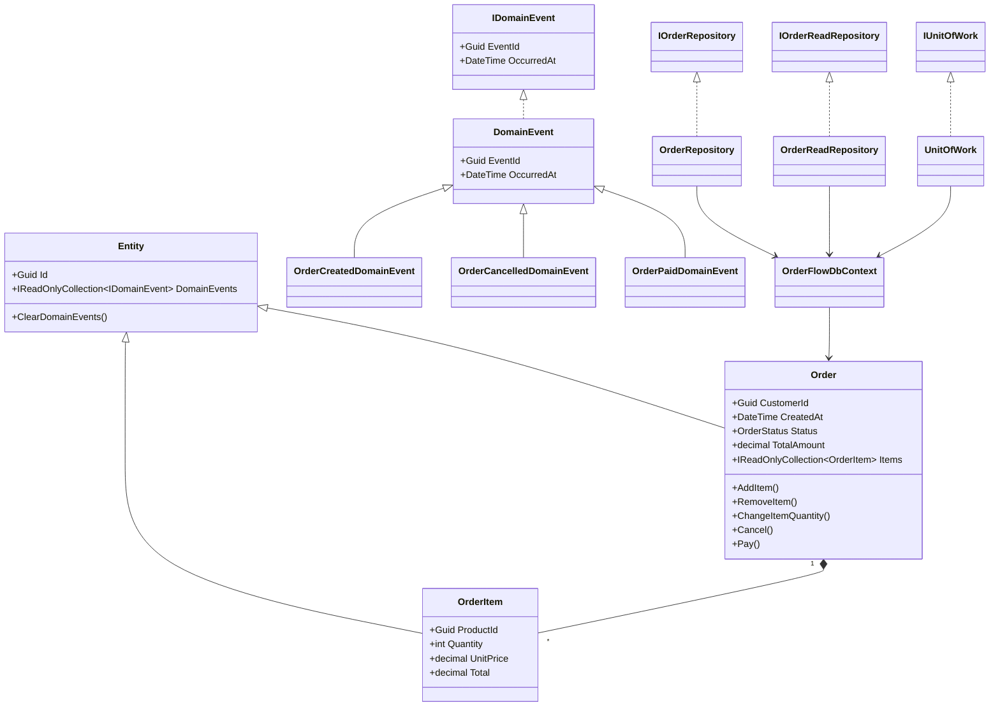

# Arquitetura Geral

Este diagrama representa a arquitetura atual do **OrderFlow**, destacando a organização das camadas **Domain**, **Application** e **Infrastructure**, bem como os principais componentes e seus relacionamentos.

A arquitetura segue os princípios de **Clean Architecture**, **Domain-Driven Design (DDD)** e **CQRS**, mantendo a separação de responsabilidades entre as camadas e o baixo acoplamento entre seus componentes.

```mermaid
classDiagram

%% ==========================
%% DOMAIN
%% ==========================

Entity <|-- Order
Entity <|-- OrderItem

Order "1" *-- "*" OrderItem

class Entity {
    +Guid Id
    +IReadOnlyCollection~IDomainEvent~ DomainEvents
    +ClearDomainEvents()
}

class Order {
    +Guid CustomerId
    +DateTime CreatedAt
    +OrderStatus Status
    +decimal TotalAmount
    +IReadOnlyCollection~OrderItem~ Items
    +AddItem()
    +RemoveItem()
    +ChangeItemQuantity()
    +Cancel()
    +Pay()
}

class OrderItem {
    +Guid ProductId
    +int Quantity
    +decimal UnitPrice
    +decimal Total
}

%% ==========================
%% DOMAIN EVENTS
%% ==========================

class IDomainEvent {
    +Guid EventId
    +DateTime OccurredAt
}

class DomainEvent {
    +Guid EventId
    +DateTime OccurredAt
}

IDomainEvent <|.. DomainEvent
DomainEvent <|-- OrderCreatedDomainEvent
DomainEvent <|-- OrderCancelledDomainEvent
DomainEvent <|-- OrderPaidDomainEvent

%% ==========================
%% APPLICATION
%% ==========================

class IOrderRepository
class IOrderReadRepository
class IUnitOfWork

%% ==========================
%% INFRASTRUCTURE
%% ==========================

class OrderFlowDbContext

class OrderRepository
class OrderReadRepository
class UnitOfWork

IOrderRepository <|.. OrderRepository
IOrderReadRepository <|.. OrderReadRepository
IUnitOfWork <|.. UnitOfWork

OrderRepository --> OrderFlowDbContext
OrderReadRepository --> OrderFlowDbContext
UnitOfWork --> OrderFlowDbContext

OrderFlowDbContext --> Order
```