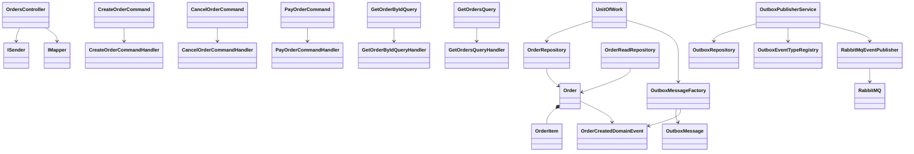
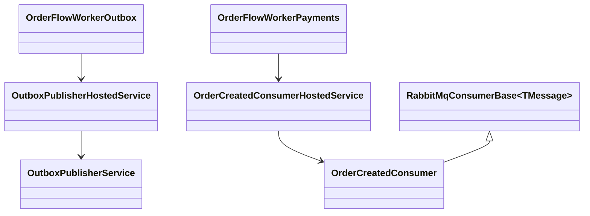
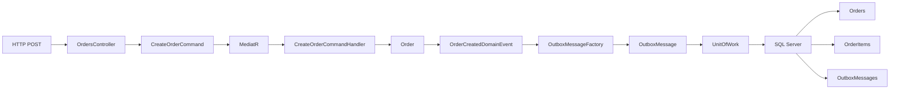
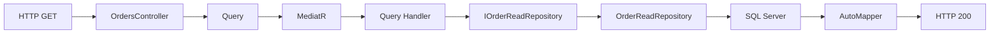
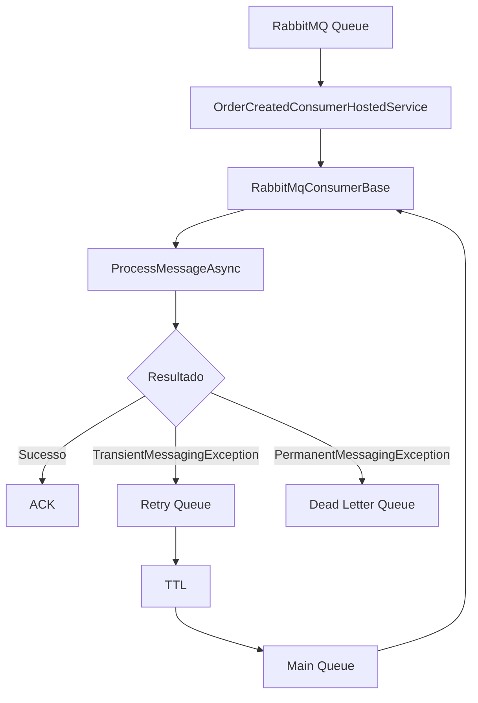
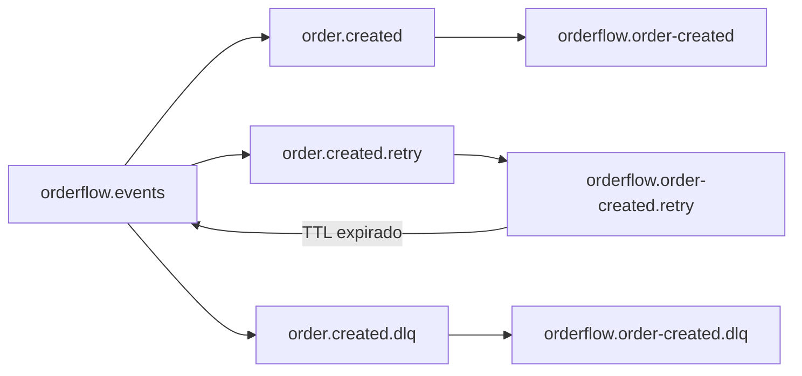
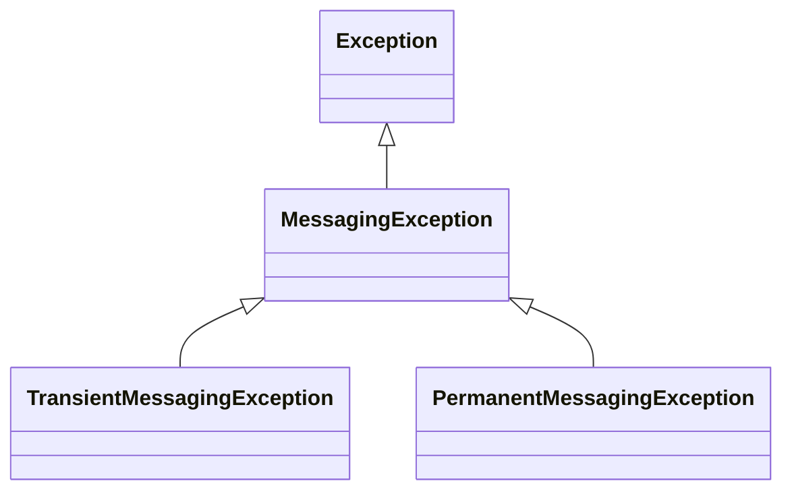
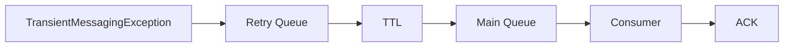
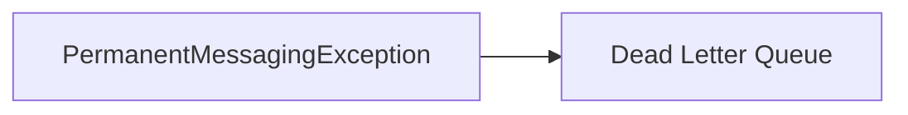
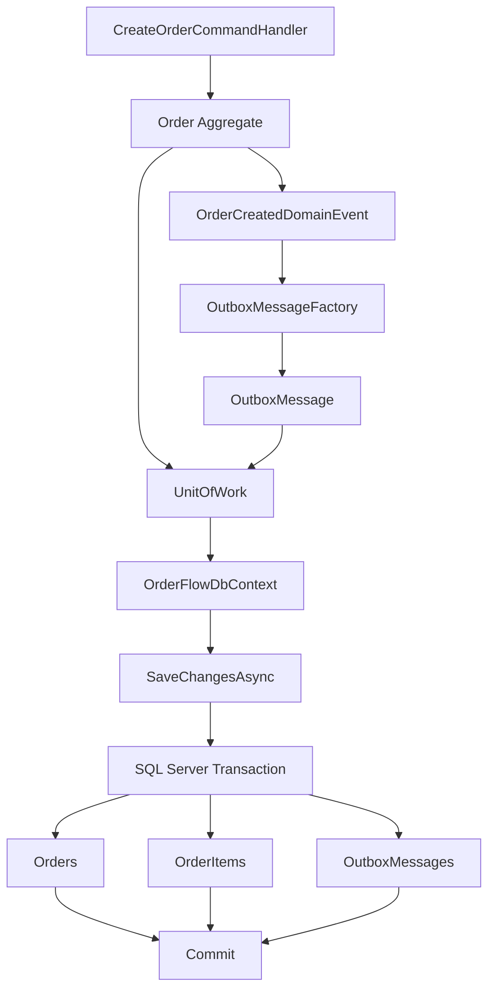

# Arquitetura Geral

## Visão Geral

O **OrderFlow** é um laboratório de arquitetura distribuída desenvolvido em **.NET 10**, cujo objetivo é demonstrar a implementação prática de padrões utilizados em sistemas corporativos modernos.

A solução foi construída seguindo os princípios de:

- Clean Architecture
- Domain-Driven Design (DDD)
- CQRS
- Domain Events
- Repository Pattern
- Unit of Work
- RabbitMQ
- Event-Driven Architecture
- Worker Pattern
- Retry
- Dead Letter Queue (DLQ)
- Transactional Outbox

A arquitetura mantém forte separação entre regras de negócio e infraestrutura, permitindo baixo acoplamento, alta coesão e facilidade de evolução.

                    ┌──────────────────────┐
                    │   OrderFlow.Api      │
                    └──────────┬───────────┘
                               │
                               ▼
                    ┌──────────────────────┐
                    │      SQL Server      │
                    │                      │
                    │  Orders             │
                    │  OrderItems         │
                    │  OutboxMessages     │
                    └──────────┬───────────┘
                               │
                               ▼
               ┌────────────────────────────┐
               │ OrderFlow.Worker.Outbox    │
               └──────────┬─────────────────┘
                          │
                          ▼
                  RabbitMQ Topic Exchange
                          │
                          ▼
               orderflow.order-created
                          │
                          ▼
               ┌───────────────────────────┐
               │ OrderFlow.Worker.Payments │
               └──────────┬────────────────┘
                          │
                          ▼
                     OrderCreatedConsumer

---

# Visão Arquitetural

```mermaid
classDiagram

%% API

class OrdersController
class ISender
class IMapper

OrdersController --> ISender
OrdersController --> IMapper

%% APPLICATION

class CreateOrderCommand
class CancelOrderCommand
class PayOrderCommand

class CreateOrderCommandHandler
class CancelOrderCommandHandler
class PayOrderCommandHandler

CreateOrderCommand --> CreateOrderCommandHandler
CancelOrderCommand --> CancelOrderCommandHandler
PayOrderCommand --> PayOrderCommandHandler

class GetOrderByIdQuery
class GetOrdersQuery

class GetOrderByIdQueryHandler
class GetOrdersQueryHandler

GetOrderByIdQuery --> GetOrderByIdQueryHandler
GetOrdersQuery --> GetOrdersQueryHandler

%% DOMAIN

class Order
class OrderItem
class OrderCreatedDomainEvent

Order *-- OrderItem
Order --> OrderCreatedDomainEvent

%% INFRASTRUCTURE

class OrderRepository
class OrderReadRepository
class UnitOfWork
class OutboxMessage
class OutboxMessageFactory
class OutboxRepository
class OutboxEventTypeRegistry
class OutboxPublisherService
class RabbitMqEventPublisher

OrderRepository --> Order
OrderReadRepository --> Order

UnitOfWork --> OrderRepository
UnitOfWork --> OutboxMessageFactory

OutboxMessageFactory --> OutboxMessage
OutboxMessageFactory --> OrderCreatedDomainEvent

OutboxPublisherService --> OutboxRepository
OutboxPublisherService --> OutboxEventTypeRegistry
OutboxPublisherService --> RabbitMqEventPublisher

class RabbitMQ

RabbitMqEventPublisher --> RabbitMQ
```

---

# Arquitetura dos Workers

```mermaid
classDiagram

%% WORKER OUTBOX

class OrderFlowWorkerOutbox
class OutboxPublisherHostedService
class OutboxPublisherService

OrderFlowWorkerOutbox --> OutboxPublisherHostedService
OutboxPublisherHostedService --> OutboxPublisherService

%% WORKER PAYMENTS

class OrderFlowWorkerPayments
class OrderCreatedConsumerHostedService
class RabbitMqConsumerBase~TMessage~
class OrderCreatedConsumer

OrderFlowWorkerPayments --> OrderCreatedConsumerHostedService
OrderCreatedConsumerHostedService --> OrderCreatedConsumer
RabbitMqConsumerBase~TMessage~ <|-- OrderCreatedConsumer
```

---

# Fluxo de Escrita (CQRS)

```mermaid
flowchart LR

A[HTTP POST]
--> B[OrdersController]
--> C[CreateOrderCommand]
--> D[MediatR]
--> E[CreateOrderCommandHandler]
--> F[Order]
--> G[OrderCreatedDomainEvent]
--> H[OutboxMessageFactory]
--> I[OutboxMessage]
--> J[UnitOfWork]
--> K[SQL Server]

K --> L[Orders]
K --> M[OrderItems]
K --> N[OutboxMessages]
```

---

# Fluxo Transactional Outbox

```mermaid
flowchart LR

A[SQL Server]
--> B[OutboxMessages]
--> C[OrderFlow.Worker.Outbox]
--> D[OutboxPublisherHostedService]
--> E[OutboxPublisherService]
--> F[OutboxEventTypeRegistry]
--> G[RabbitMqEventPublisher]
--> H[RabbitMQ Exchange]
--> I[orderflow.order-created]
--> J[OrderFlow.Worker.Payments]
--> K[OrderCreatedConsumer]
--> L[ACK]
```
---

# Fluxo de Leitura (CQRS)

```mermaid
flowchart LR

A[HTTP GET]
--> B[OrdersController]
--> C[Query]
--> D[MediatR]
--> E[Query Handler]
--> F[IOrderReadRepository]
--> G[OrderReadRepository]
--> H[SQL Server]
--> I[AutoMapper]
--> J[HTTP 200]
```

---

# Fluxo de Processamento Assíncrono

```mermaid
flowchart TD

A[RabbitMQ Queue]
--> B[OrderCreatedConsumerHostedService]
--> C[RabbitMqConsumerBase]
--> D[ProcessMessageAsync]

D --> E{Resultado}

E -->|Sucesso| F[ACK]

E -->|TransientMessagingException| G[Retry Queue]

G --> H[TTL]

H --> I[Main Queue]

I --> C

E -->|PermanentMessagingException| J[Dead Letter Queue]
```

---

# Topologia RabbitMQ

```mermaid
flowchart LR

A[orderflow.events]

A --> B[order.created]
B --> C[orderflow.order-created]

A --> D[order.created.retry]
D --> E[orderflow.order-created.retry]

A --> F[order.created.dlq]
F --> G[orderflow.order-created.dlq]

E -->|TTL expirado| A
```

---

# Hierarquia das Exceções

```mermaid
classDiagram

Exception <|-- MessagingException

MessagingException <|-- TransientMessagingException

MessagingException <|-- PermanentMessagingException
```

---

# Fluxo de Retry

```mermaid
flowchart LR

A[TransientMessagingException]
--> B[Retry Queue]
--> C[TTL]
--> D[Main Queue]
--> E[Consumer]
--> F[ACK]
```

---

# Fluxo de Dead Letter Queue

```mermaid
flowchart LR

A[PermanentMessagingException]
--> B[Dead Letter Queue]
```

---

# Fluxo de Persistência Transacional

```mermaid
flowchart TD

A[CreateOrderCommandHandler]
--> B[Order Aggregate]

B --> C[OrderCreatedDomainEvent]

C --> D[OutboxMessageFactory]

D --> E[OutboxMessage]

B --> F[UnitOfWork]
E --> F

F --> G[OrderFlowDbContext]

G --> H[SaveChangesAsync]

H --> I[SQL Server Transaction]

I --> J[Orders]
I --> K[OrderItems]
I --> L[OutboxMessages]

J --> M[Commit]
K --> M
L --> M
```
---

# Responsabilidades das Camadas

| Camada / Processo | Responsabilidade |
|---|---|
| **Api** | Receber requisições HTTP, mapear contratos, enviar Commands e Queries e produzir respostas HTTP. |
| **Application** | Orquestrar casos de uso, validar entradas e depender apenas de abstrações. |
| **Domain** | Concentrar entidades, regras de negócio, invariantes, transições de estado e Domain Events. |
| **Infrastructure** | Implementar persistência, SQL Server, Unit of Work, Transactional Outbox, RabbitMQ, Retry, Dead Letter Queue e integrações externas. |
| **OrderFlow.Worker.Outbox** | Consultar mensagens não processadas na tabela `OutboxMessages`, desserializar os eventos, publicá-los no RabbitMQ e preencher `ProcessedOnUtc` após o sucesso. |
| **OrderFlow.Worker.Payments** | Consumir eventos do RabbitMQ, executar o processamento específico da mensagem e confirmar a entrega por meio de ACK. |

---

# Princípios Arquiteturais

A arquitetura do OrderFlow foi construída utilizando os seguintes princípios e padrões:

- Clean Architecture
- Domain-Driven Design (DDD)
- CQRS
- Domain Events
- Repository Pattern
- Unit of Work
- Dependency Injection
- RabbitMQ
- Event-Driven Architecture
- Worker Pattern
- Retry
- Dead Letter Queue (DLQ)
- Transactional Outbox
- At Least Once Delivery
- Consistência Eventual

---

# Observações Arquiteturais

A camada **Domain** permanece completamente independente de frameworks, banco de dados, HTTP ou RabbitMQ.

A camada **Application** depende apenas de abstrações, preservando o desacoplamento entre regras de negócio e infraestrutura.

Toda a infraestrutura de persistência e mensageria permanece centralizada na camada **Infrastructure**.

O `RabbitMqConsumerBase<TMessage>` concentra toda a política de processamento de mensagens, incluindo:

- desserialização;
- ACK;
- Retry;
- Dead Letter Queue;
- republicação;
- controle do header `x-orderflow-retry-count`;
- classificação entre falhas transitórias e permanentes.

Os Consumers concretos permanecem responsáveis exclusivamente pela lógica de negócio, desconhecendo detalhes de infraestrutura como ACK, Retry, DLQ e republicação de mensagens.

## Transactional Outbox

O **Transactional Outbox Pattern** foi implementado para garantir consistência entre a persistência do banco de dados e a publicação de eventos no RabbitMQ.

Os Domain Events são convertidos em registros da tabela `OutboxMessages` durante a mesma transação utilizada para persistir o Aggregate Root.

Após a confirmação da transação, o `OrderFlow.Worker.Outbox` consulta periodicamente as mensagens ainda não processadas, desserializa os eventos, publica-os no RabbitMQ e atualiza o campo `ProcessedOnUtc`.

Essa abordagem elimina a janela de inconsistência existente entre o banco de dados e o broker de mensagens, garantindo o padrão **Transactional Outbox** e o modelo de entrega **At Least Once**.

## Cenários Validados

Durante a implementação foram executados e validados os seguintes cenários:

- publicação normal de eventos;
- RabbitMQ indisponível durante a criação do pedido;
- recuperação automática após o retorno do RabbitMQ;
- Worker.Outbox indisponível durante a criação do pedido;
- recuperação automática após a inicialização do Worker.Outbox;
- preservação de `EventId`, `OccurredAt` e `Payload` durante a serialização e desserialização;
- processamento completo até o ACK do Consumer.

Esses testes confirmam a resiliência da arquitetura e a correta implementação do **Transactional Outbox Pattern**.