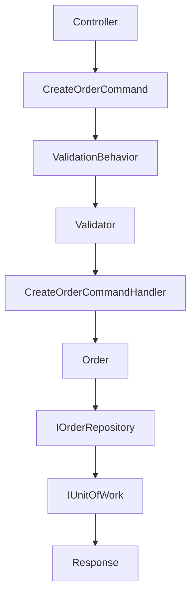

# Fluxo de Criação de Pedido

```mermaid
flowchart TD

A[Controller]

--> B[CreateOrderCommand]

--> C[ValidationBehavior]

--> D[Validator]

--> E[CreateOrderCommandHandler]

--> F[Order]

--> G[IOrderRepository]

--> H[IUnitOfWork]

--> I[Response]
```