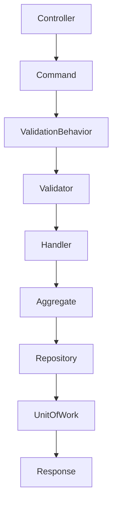

# Fluxo dos Casos de Uso

```mermaid
flowchart TD

A[Controller]

--> B[Command]

--> C[ValidationBehavior]

--> D[Validator]

--> E[Handler]

--> F[Aggregate]

--> G[Repository]

--> H[UnitOfWork]

--> I[Response]
```