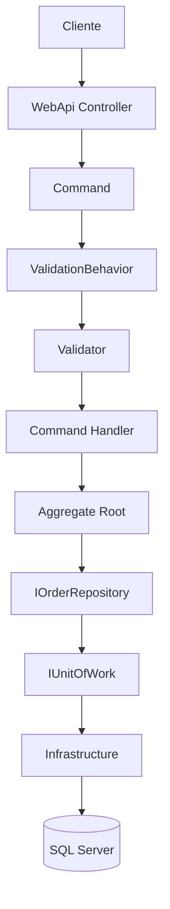

# Fluxo de Execução de um Command

Este diagrama representa o fluxo completo de execução de um **Command** no OrderFlow.

Todos os Commands implementados na camada **Application** seguem exatamente esse fluxo.



---

# Descrição do fluxo

| Etapa | Responsabilidade |
|-------|------------------|
| Cliente | Envia uma requisição HTTP para a aplicação. |
| WebApi Controller | Recebe a requisição e encaminha o Command ao MediatR. |
| Command | Representa a intenção de alterar o estado da aplicação. |
| ValidationBehavior | Executa automaticamente todos os Validators registrados antes do Handler. |
| Validator | Valida os dados de entrada da aplicação. |
| Command Handler | Orquestra o caso de uso, delegando as regras de negócio ao domínio. |
| Aggregate Root | Executa todas as regras de negócio e altera o estado do domínio. |
| IOrderRepository | Abstração responsável pelas operações de escrita sobre o Aggregate. |
| IUnitOfWork | Confirma as alterações realizadas durante o caso de uso. |
| Infrastructure | Implementa as abstrações de persistência utilizadas pela Application. |
| SQL Server | Responsável pela persistência definitiva dos dados. |

---

# Responsabilidades por camada

```text
Presentation
│
└── WebApi Controller

Application
│
├── Command
├── ValidationBehavior
├── Validator
├── Command Handler
└── IUnitOfWork

Domain
│
├── Aggregate Root
└── IOrderRepository

Infrastructure
│
├── Repository
├── UnitOfWork
└── SQL Server
```

---

# Observações

- O Controller não conhece o domínio.
- O ValidationBehavior impede a execução do Handler quando a validação falha.
- O Handler não implementa regras de negócio.
- Apenas o Aggregate Root altera o estado do domínio.
- O Handler depende exclusivamente de abstrações.
- O Aggregate não conhece mecanismos de persistência.
- A Infrastructure implementa os contratos definidos pelas camadas internas.
- A camada Application permanece desacoplada do Entity Framework Core e do SQL Server.