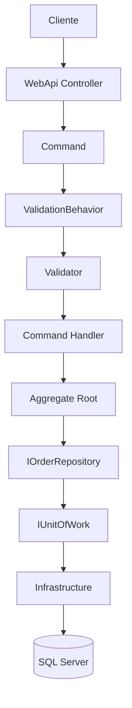

# Fluxo de Execução de um Command

Este diagrama representa o fluxo completo de execução de um **Command** no OrderFlow.



---

## Descrição do fluxo

| Etapa | Responsabilidade |
|-------|------------------|
| Cliente | Envia a requisição HTTP. |
| Controller | Recebe a requisição e envia o Command para o MediatR. |
| Command | Representa a intenção do usuário. |
| ValidationBehavior | Executa automaticamente todos os Validators registrados. |
| Validator | Valida a entrada da aplicação. |
| Handler | Orquestra o caso de uso. |
| Aggregate Root | Executa as regras de negócio. |
| Repository | Persiste ou recupera o Aggregate. |
| UnitOfWork | Confirma a transação da operação. |
| Infrastructure | Implementa os detalhes de persistência. |
| SQL Server | Armazena os dados da aplicação. |

---

## Responsabilidades por camada

```text
Presentation
│
├── Controller
│
Application
│
├── Command
├── ValidationBehavior
├── Validator
└── Handler
│
Domain
│
├── Aggregate Root
│
Infrastructure
│
├── Repository
├── UnitOfWork
└── SQL Server
```

---

## Observações

- O Controller não conhece o domínio.
- O Handler não conhece Entity Framework Core.
- O Aggregate não conhece banco de dados.
- A Infrastructure implementa as abstrações definidas pelas camadas internas.
- Toda regra de negócio permanece encapsulada no domínio.